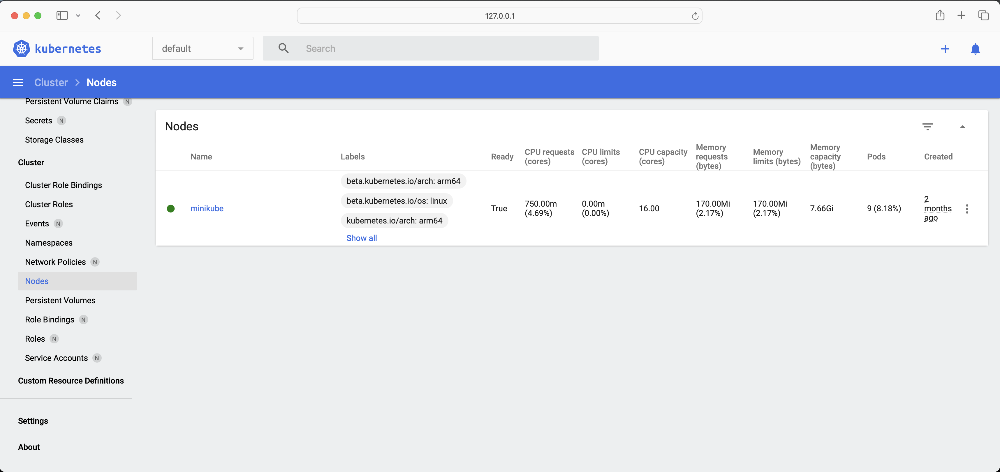

# Setup Kubernetes for Local Development
First we need to install [Minikube](https://minikube.sigs.k8s.io/docs/start/?arch=%2Fmacos%2Farm64%2Fstable%2Fbinary+download)
which is a local Kubernetes, focusing on making it easy to learn and develop for Kubernetes, 
minikube quickly sets up a local **Kubernetes cluster** on macOS, Linux, and Windows.

Kubernetes provides a command line tool for communicating with a **Kubernetes cluster's** control plane, using the Kubernetes API.
This tool is named [kubectl](https://kubernetes.io/docs/tasks/tools/install-kubectl-macos/)

## Start Cluster
```shell
minikube start
```

```shell-outut
😄  minikube v1.33.1 on Darwin 14.1.2 (arm64)
✨  Using the docker driver based on existing profile
👍  Starting "minikube" primary control-plane node in "minikube" cluster
🚜  Pulling base image v0.0.44 ...
🔄  Restarting existing docker container for "minikube" ...
🐳  Preparing Kubernetes v1.30.0 on Docker 26.1.1 ...
🔎  Verifying Kubernetes components...
    ▪ Using image gcr.io/k8s-minikube/storage-provisioner:v5
    ▪ Using image docker.io/kubernetesui/dashboard:v2.7.0
    ▪ Using image docker.io/kubernetesui/metrics-scraper:v1.0.8
💡  Some dashboard features require the metrics-server addon. To enable all features please run:

	minikube addons enable metrics-server

🌟  Enabled addons: default-storageclass, storage-provisioner, dashboard
🏄  Done! kubectl is now configured to use "minikube" cluster and "default" namespace by default
```

## Check Status

```shell
minikube status  
```

```shell-output
minikube
type: Control Plane
host: Running
kubelet: Running
apiserver: Running
kubeconfig: Configured
```

## Cluster Dashboard

```shell
minikube dashboard
```

```shell-output
🤔  Verifying dashboard health ...
🚀  Launching proxy ...
🤔  Verifying proxy health ...
🎉  Opening http://127.0.0.1:56301/api/v1/namespaces/kubernetes-dashboard/services/http:kubernetes-dashboard:/proxy/ in your default browser...
```




## Communicating with the Cluster

In order for kubectl to find and access a Kubernetes cluster, it needs a `kubeconfig` file, which is created automatically 
when you create a cluster using `kube-up.sh` or successfully deploy a `Minikube` cluster. By default, kubectl configuration 
is located at `~/.kube/config`.

```shell
cat ~/.kube/config
```

```shell-output
apiVersion: v1
clusters:
- cluster:
    certificate-authority: /Users/[host-machine]/.minikube/ca.crt
    extensions:
    - extension:
        last-update: Sun, 18 Aug 2024 14:54:47 PDT
        provider: minikube.sigs.k8s.io
        version: v1.33.1
      name: cluster_info
    server: https://127.0.0.1:56242
  name: minikube
contexts:
- context:
    cluster: minikube
    extensions:
    - extension:
        last-update: Sun, 18 Aug 2024 14:54:47 PDT
        provider: minikube.sigs.k8s.io
        version: v1.33.1
      name: context_info
    namespace: default
    user: minikube
  name: minikube
current-context: minikube
kind: Config
preferences: {}
users:
- name: minikube
  user:
    client-certificate: /Users/[host-machine]/.minikube/profiles/minikube/client.crt
    client-key: /Users/[host-machine]/.minikube/profiles/minikube/client.key
```

```shell
kubectl cluster-info
```

```shell-output
Kubernetes control plane is running at https://127.0.0.1:56242
CoreDNS is running at https://127.0.0.1:56242/api/v1/namespaces/kube-system/services/kube-dns:dns/proxy

To further debug and diagnose cluster problems, use 'kubectl cluster-info dump'.
```

