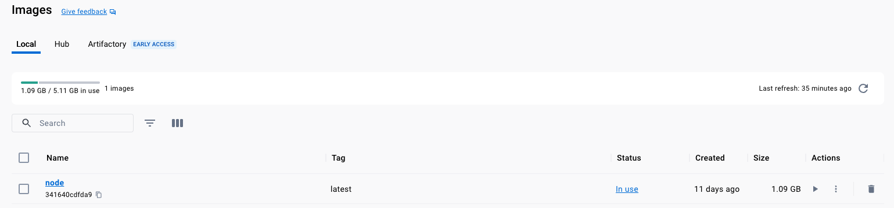
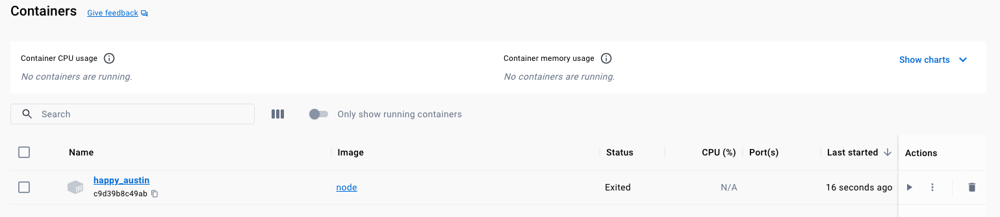
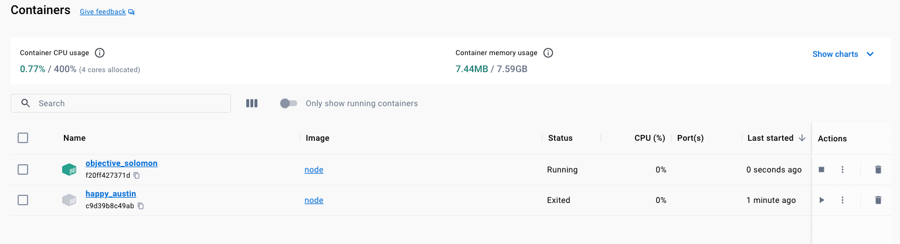

# Using Prebuild Images

1. `Image`: Logic, Code (Blueprint)
2. `Container`: Running Instance of Software based on an `Image`.

To download (if required) and use the node image from docker hub



```shell
docker run node
```

To see the containers created `ps` stands for processes `-a` for all.

```shell
docker ps -a
```

```shell-output
CONTAINER ID   IMAGE                COMMAND                  CREATED              STATUS                      PORTS     NAMES
da665c4a4013   node                 "docker-entrypoint.s…"   About a minute ago   Exited (0) 30 seconds ago             strange_grothendieck
```



To expose the Node JS REPL in the container (interactive session to hosting machine)

```shell
docker run -it node
```



```node-repl
docker-udemy % docker run -it node
Welcome to Node.js v20.5.1.
Type ".help" for more information.
> console.log('juan');
juan
undefined
> 
```