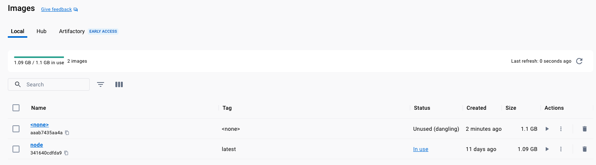

# Running a Container from a Docker Image

## 1. Creating a Docker Image
To create our image from the local Docker file

```shell
docker build .
```

```shell-output
docker build .
[+] Building 3.4s (9/9) FINISHED                                                                                                                                                            docker:desktop-linux
 => [internal] load .dockerignore                                                                                                                                                                           0.0s
 => => transferring context: 2B                                                                                                                                                                             0.0s
 => [internal] load build definition from Dockerfile                                                                                                                                                        0.0s
 => => transferring dockerfile: 866B                                                                                                                                                                        0.0s
 => [internal] load metadata for docker.io/library/node:latest                                                                                                                                              0.0s
 => [1/4] FROM docker.io/library/node                                                                                                                                                                       0.1s
 => [internal] load build context                                                                                                                                                                           0.0s
 => => transferring context: 2.42kB                                                                                                                                                                         0.0s
 => [2/4] WORKDIR /app                                                                                                                                                                                      0.0s
 => [3/4] COPY .. /app                                                                                                                                                                                      0.0s
 => [4/4] RUN npm install                                                                                                                                                                                   3.0s
 => exporting to image                                                                                                                                                                                      0.2s 
 => => exporting layers                                                                                                                                                                                     0.2s
 => => writing image sha256:aaab7435aa4aad5895d08736eb29b23c56196702f6d6723f6ba3e200057e2f82   
```

## 2. Listing a Docker Image(s)

To list our docker image

```shell
docker image ls
```

```shell-output
docker image ls
REPOSITORY   TAG       IMAGE ID       CREATED         SIZE
<none>       <none>    aaab7435aa4a   3 minutes ago   1.1GB
node         latest    341640cdfda9   10 days ago     1.1GB
```





## 3. Running a Docker Image
To run the image, we can execute `docker run [image_id]` using the previous image:

```shell
docker run aaab7435aa4a
```

```shell
docker run aaab7435aa4aad5895d08736eb29b23c56196702f6d6723f6ba3e200057e2f82
```


## 3. Stopping a Docker Container
Since the container is running but the exposed `port` was not working on the local machine, we need to stop the container as:

```shell
docker ps
```
>NOTE: Only running container will be shown, use `-a` flag to list all (including exited).

```shell-output
CONTAINER ID   IMAGE          COMMAND                  CREATED         STATUS         PORTS     NAMES
7f35b565b5a7   aaab7435aa4a   "docker-entrypoint.s…"   3 minutes ago   Up 3 minutes   80/tcp    festive_rosalind
```

and now with the container's name:

```shell
docker stop festive_rosalind
```

or stop by `id`:

```shell
docker stop 7f35b565b5a7
```


## 4. Exposing the Container's Port
The container was running but the `port` was not exposed, in our Docker file:

```dockerfile
EXPOSE 80
```

is for documentation purposes, it is a best practice, it won't instruct docker to expose the port to access it.

To expose the `port` (80 in this case) we need to use the **publish** flag `-p` as: 

`-p "HOST_MACHINE_PORT:INTERNAL_CONTAINER_PORT"`

```shell
docker run -p 5000:80 aaab7435aa4a
```


