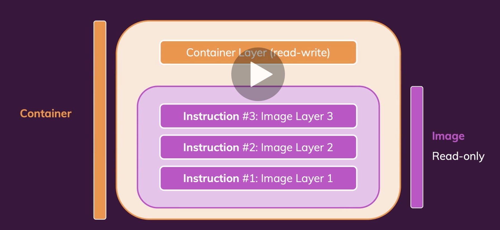
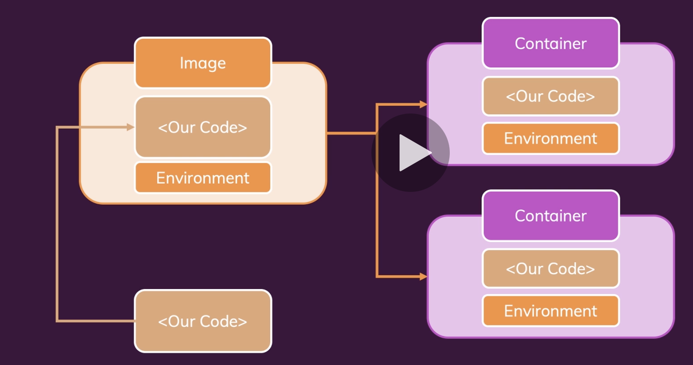

# Layers in Docker Image

For each command (excluding `CMD`) Docker creates a `layer` and caches it to build and reuse it if nothing changed after the 
instruction.



In this example, we can optimize how Docker build those layers and reuse the `npm install` step if we first copy the package into the
image, if the project dependencies didn't change `docker` will be able to re-use the cached version of npm install

```dockerfile
COPY package.json /app
RUN npm install
COPY . /app
```
Since most of the changes will happen in the source code, we can change the execution order and speed up the `image` build.

```shell
cd code
docker build .
```

```shell-output
docker build .
[+] Building 3.0s (10/10) FINISHED                                                                                                                                                          docker:desktop-linux
 => [internal] load .dockerignore                                                                                                                                                                           0.0s
 => => transferring context: 2B                                                                                                                                                                             0.0s
 => [internal] load build definition from Dockerfile                                                                                                                                                        0.0s
 => => transferring dockerfile: 890B                                                                                                                                                                        0.0s
 => [internal] load metadata for docker.io/library/node:latest                                                                                                                                              0.0s
 => [1/5] FROM docker.io/library/node                                                                                                                                                                       0.0s
 => [internal] load build context                                                                                                                                                                           0.0s
 => => transferring context: 1.38kB                                                                                                                                                                         0.0s
 => CACHED [2/5] WORKDIR /app                                                                                                                                                                               0.0s
 => [3/5] COPY package.json /app                                                                                                                                                                            0.0s
 => [4/5] RUN npm install                                                                                                                                                                                   2.7s
 => [5/5] COPY . /app                                                                                                                                                                                       0.0s
 => exporting to image                                                                                                                                                                                      0.2s
 => => exporting layers                                                                                                                                                                                     0.2s
 => => writing image sha256:e9af95cd4351e4ff92dc24d502f6b5b3b234ec6bb5d4b207ecbd1239aaef156e                                                                                                                0.0s 
                                                                                                                                                                                                                 

docker build .
[+] Building 0.1s (10/10) FINISHED                                                                                                                                                          docker:desktop-linux
 => [internal] load .dockerignore                                                                                                                                                                           0.0s
 => => transferring context: 2B                                                                                                                                                                             0.0s
 => [internal] load build definition from Dockerfile                                                                                                                                                        0.0s
 => => transferring dockerfile: 890B                                                                                                                                                                        0.0s
 => [internal] load metadata for docker.io/library/node:latest                                                                                                                                              0.0s
 => [1/5] FROM docker.io/library/node                                                                                                                                                                       0.0s
 => [internal] load build context                                                                                                                                                                           0.0s
 => => transferring context: 269B                                                                                                                                                                           0.0s
 => CACHED [2/5] WORKDIR /app                                                                                                                                                                               0.0s
 => CACHED [3/5] COPY package.json /app                                                                                                                                                                     0.0s
 => CACHED [4/5] RUN npm install                                                                                                                                                                            0.0s
 => [5/5] COPY . /app                                                                                                                                                                                       0.0s
 => exporting to image                                                                                                                                                                                      0.0s
 => => exporting layers                                                                                                                                                                                     0.0s
 => => writing image sha256:3e27fd0f14dfee190c3e90dcdb9f239b233cf7b8788a8e28f876e324621b43e9   
```

**Note** how on the second `docker build` command, after changing the source code, 
we received `CACHED` for instructions `[2/4/5]`:

```shell-ouput
 => CACHED [2/5] WORKDIR /app                                                                                                                                                                               0.0s
 => CACHED [3/5] COPY package.json /app                                                                                                                                                                     0.0s
 => CACHED [4/5] RUN npm install   
```

If we modify the `package.json`, then the cached layers will not be unable to be re-used:

From:
```code-change
  "name": "custom-image",
```
To:
```code-change
  "name": "custom-image-update",
```

```shell-output
docker build .
[+] Building 3.3s (10/10) FINISHED                                                                                                                                                          docker:desktop-linux
 => [internal] load .dockerignore                                                                                                                                                                           0.0s
 => => transferring context: 2B                                                                                                                                                                             0.0s
 => [internal] load build definition from Dockerfile                                                                                                                                                        0.0s
 => => transferring dockerfile: 890B                                                                                                                                                                        0.0s
 => [internal] load metadata for docker.io/library/node:latest                                                                                                                                              0.0s
 => [1/5] FROM docker.io/library/node                                                                                                                                                                       0.0s
 => [internal] load build context                                                                                                                                                                           0.0s
 => => transferring context: 366B                                                                                                                                                                           0.0s
 => CACHED [2/5] WORKDIR /app                                                                                                                                                                               0.0s
 => [3/5] COPY package.json /app                                                                                                                                                                            0.0s
 => [4/5] RUN npm install                                                                                                                                                                                   3.0s
 => [5/5] COPY . /app                                                                                                                                                                                       0.0s
 => exporting to image                                                                                                                                                                                      0.2s
 => => exporting layers                                                                                                                                                                                     0.2s
 => => writing image sha256:62d1fc18e4fd3c3871c5bfd43f6eb024c5f9059f16820927e08341e8a0f48397 
```

This time, only the `WORKDIR` instruction (layer) was able to be re-used:

```shell-ouput
 => CACHED [2/5] WORKDIR /app                                                                                                                                                                               0.0s
 => [3/5] COPY package.json /app                                                                                                                                                                            0.0s
 => [4/5] RUN npm install                                                                                                                                                                                   3.0s
 => [5/5] COPY . /app   
```

## Summary


- `Image`: Read-Only immutable template with instruction to build a `Container`
- `Container`: Runtime instance of an `Image` that gets created with `docker run` command.

The `Container` will use the code/environment stored in an `Image` and add a thin layer to allocate resources to run the 
application, it won't copy the code into each container.