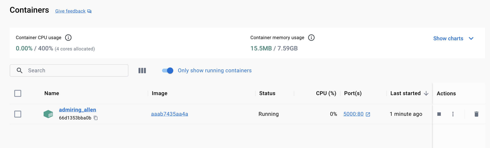
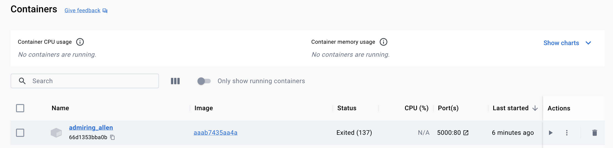

# Stopping and Restarting Containers

To see the all the commands that can be executed from `Docker` you can use:

```shell
docker --help
#or
docker help
```

```shell-output
docker help  

Usage:  docker [OPTIONS] COMMAND

A self-sufficient runtime for containers

Common Commands:
  run         Create and run a new container from an image
  exec        Execute a command in a running container
  ps          List containers
  build       Build an image from a Dockerfile
  pull        Download an image from a registry
  push        Upload an image to a registry
  images      List images
  login       Log in to a registry
  logout      Log out from a registry
  search      Search Docker Hub for images
  version     Show the Docker version information
  info        Display system-wide information

Management Commands:
  builder     Manage builds
  buildx*     Docker Buildx (Docker Inc., v0.11.0)
  compose*    Docker Compose (Docker Inc., v2.19.1)
  container   Manage containers
  context     Manage contexts
  dev*        Docker Dev Environments (Docker Inc., v0.1.0)
  extension*  Manages Docker extensions (Docker Inc., v0.2.20)
  image       Manage images
  init*       Creates Docker-related starter files for your project (Docker Inc., v0.1.0-beta.6)
  manifest    Manage Docker image manifests and manifest lists
  network     Manage networks
  plugin      Manage plugins
  sbom*       View the packaged-based Software Bill Of Materials (SBOM) for an image (Anchore Inc., 0.6.0)
  scan*       Docker Scan (Docker Inc., v0.26.0)
  scout*      Command line tool for Docker Scout (Docker Inc., 0.16.1)
  system      Manage Docker
  trust       Manage trust on Docker images
  volume      Manage volumes

Swarm Commands:
  swarm       Manage Swarm

Commands:
  attach      Attach local standard input, output, and error streams to a running container
  commit      Create a new image from a container's changes
  cp          Copy files/folders between a container and the local filesystem
  create      Create a new container
  diff        Inspect changes to files or directories on a container's filesystem
  events      Get real time events from the server
  export      Export a container's filesystem as a tar archive
  history     Show the history of an image
  import      Import the contents from a tarball to create a filesystem image
  inspect     Return low-level information on Docker objects
  kill        Kill one or more running containers
  load        Load an image from a tar archive or STDIN
  logs        Fetch the logs of a container
  pause       Pause all processes within one or more containers
  port        List port mappings or a specific mapping for the container
  rename      Rename a container
  restart     Restart one or more containers
  rm          Remove one or more containers
  rmi         Remove one or more images
  save        Save one or more images to a tar archive (streamed to STDOUT by default)
  start       Start one or more stopped containers
  stats       Display a live stream of container(s) resource usage statistics
  stop        Stop one or more running containers
  tag         Create a tag TARGET_IMAGE that refers to SOURCE_IMAGE
  top         Display the running processes of a container
  unpause     Unpause all processes within one or more containers
  update      Update configuration of one or more containers
  wait        Block until one or more containers stop, then print their exit codes

Global Options:
      --config string      Location of client config files (default "/Users/JCLG/.docker")
  -c, --context string     Name of the context to use to connect to the daemon (overrides DOCKER_HOST env var and default context set with "docker context use")
  -D, --debug              Enable debug mode
  -H, --host list          Daemon socket to connect to
  -l, --log-level string   Set the logging level ("debug", "info", "warn", "error", "fatal") (default "info")
      --tls                Use TLS; implied by --tlsverify
      --tlscacert string   Trust certs signed only by this CA (default "/Users/JCLG/.docker/ca.pem")
      --tlscert string     Path to TLS certificate file (default "/Users/JCLG/.docker/cert.pem")
      --tlskey string      Path to TLS key file (default "/Users/JCLG/.docker/key.pem")
      --tlsverify          Use TLS and verify the remote
  -v, --version            Print version information and quit

Run 'docker COMMAND --help' for more information on a command.

For more help on how to use Docker, head to https://docs.docker.com/go/guides/
```

## Additional Information / Nested Help

At the same time we can bring additional information of one command by sending the -h flag to it

```shell
docker ps --help
```

```shell-output
docker ps --help

Usage:  docker ps [OPTIONS]

List containers

Aliases:
  docker container ls, docker container list, docker container ps, docker ps

Options:
  -a, --all             Show all containers (default shows just running)
  -f, --filter filter   Filter output based on conditions provided
      --format string   Format output using a custom template:
                        'table':            Print output in table format with column headers (default)
                        'table TEMPLATE':   Print output in table format using the given Go template
                        'json':             Print in JSON format
                        'TEMPLATE':         Print output using the given Go template.
                        Refer to https://docs.docker.com/go/formatting/ for more information about formatting output with templates
  -n, --last int        Show n last created containers (includes all states) (default -1)
  -l, --latest          Show the latest created container (includes all states)
      --no-trunc        Don't truncate output
  -q, --quiet           Only display container IDs
  -s, --size            Display total file sizes
```

In example below, we will inspect all container

```shell
docker ps -a
```

```shell-output
docker ps -a 
CONTAINER ID   IMAGE          COMMAND                  CREATED        STATUS                      PORTS     NAMES
66d1353bba0b   aaab7435aa4a   "docker-entrypoint.s…"   26 hours ago   Exited (137) 26 hours ago             admiring_allen
7f35b565b5a7   aaab7435aa4a   "docker-entrypoint.s…"   27 hours ago   Exited (137) 26 hours ago             festive_rosalind
16a254c850a7   node           "docker-entrypoint.s…"   28 hours ago   Exited (0) 28 hours ago               infallible_boyd
f20ff427371d   node           "docker-entrypoint.s…"   28 hours ago   Exited (0) 28 hours ago               objective_solomon
c9d39b8c49ab   node           "docker-entrypoint.s…"   28 hours ago   Exited (0) 28 hours ago               happy_austin
```

Here, we can see the different options we can pass to the `run` command:

```shell
docker run --help
```

```shell-output
docker run --help

Usage:  docker run [OPTIONS] IMAGE [COMMAND] [ARG...]

Create and run a new container from an image

Aliases:
  docker container run, docker run

Options:
      --add-host list                  Add a custom host-to-IP mapping (host:ip)
      --annotation map                 Add an annotation to the container (passed through to the OCI runtime) (default map[])
  -a, --attach list                    Attach to STDIN, STDOUT or STDERR
      --blkio-weight uint16            Block IO (relative weight), between 10 and 1000, or 0 to disable (default 0)
      --blkio-weight-device list       Block IO weight (relative device weight) (default [])
      --cap-add list                   Add Linux capabilities
      --cap-drop list                  Drop Linux capabilities
      --cgroup-parent string           Optional parent cgroup for the container
      --cgroupns string                Cgroup namespace to use (host|private)
                                       'host':    Run the container in the Docker host's cgroup namespace
                                       'private': Run the container in its own private cgroup namespace
                                       '':        Use the cgroup namespace as configured by the
                                                  default-cgroupns-mode option on the daemon (default)
      --cidfile string                 Write the container ID to the file
      --cpu-period int                 Limit CPU CFS (Completely Fair Scheduler) period
      --cpu-quota int                  Limit CPU CFS (Completely Fair Scheduler) quota
      --cpu-rt-period int              Limit CPU real-time period in microseconds
      --cpu-rt-runtime int             Limit CPU real-time runtime in microseconds
  -c, --cpu-shares int                 CPU shares (relative weight)
      --cpus decimal                   Number of CPUs
      --cpuset-cpus string             CPUs in which to allow execution (0-3, 0,1)
      --cpuset-mems string             MEMs in which to allow execution (0-3, 0,1)
  -d, --detach                         Run container in background and print container ID
      --detach-keys string             Override the key sequence for detaching a container
      --device list                    Add a host device to the container
      --device-cgroup-rule list        Add a rule to the cgroup allowed devices list
      --device-read-bps list           Limit read rate (bytes per second) from a device (default [])
      --device-read-iops list          Limit read rate (IO per second) from a device (default [])
      --device-write-bps list          Limit write rate (bytes per second) to a device (default [])
      --device-write-iops list         Limit write rate (IO per second) to a device (default [])
      --disable-content-trust          Skip image verification (default true)
      --dns list                       Set custom DNS servers
      --dns-option list                Set DNS options
      --dns-search list                Set custom DNS search domains
      --domainname string              Container NIS domain name
      --entrypoint string              Overwrite the default ENTRYPOINT of the image
  -e, --env list                       Set environment variables
      --env-file list                  Read in a file of environment variables
      --expose list                    Expose a port or a range of ports
      --gpus gpu-request               GPU devices to add to the container ('all' to pass all GPUs)
      --group-add list                 Add additional groups to join
      --health-cmd string              Command to run to check health
      --health-interval duration       Time between running the check (ms|s|m|h) (default 0s)
      --health-retries int             Consecutive failures needed to report unhealthy
      --health-start-period duration   Start period for the container to initialize before starting health-retries countdown (ms|s|m|h) (default 0s)
      --health-timeout duration        Maximum time to allow one check to run (ms|s|m|h) (default 0s)
      --help                           Print usage
  -h, --hostname string                Container host name
      --init                           Run an init inside the container that forwards signals and reaps processes
  -i, --interactive                    Keep STDIN open even if not attached
      --ip string                      IPv4 address (e.g., 172.30.100.104)
      --ip6 string                     IPv6 address (e.g., 2001:db8::33)
      --ipc string                     IPC mode to use
      --isolation string               Container isolation technology
      --kernel-memory bytes            Kernel memory limit
  -l, --label list                     Set meta data on a container
      --label-file list                Read in a line delimited file of labels
      --link list                      Add link to another container
      --link-local-ip list             Container IPv4/IPv6 link-local addresses
      --log-driver string              Logging driver for the container
      --log-opt list                   Log driver options
      --mac-address string             Container MAC address (e.g., 92:d0:c6:0a:29:33)
  -m, --memory bytes                   Memory limit
      --memory-reservation bytes       Memory soft limit
      --memory-swap bytes              Swap limit equal to memory plus swap: '-1' to enable unlimited swap
      --memory-swappiness int          Tune container memory swappiness (0 to 100) (default -1)
      --mount mount                    Attach a filesystem mount to the container
      --name string                    Assign a name to the container
      --network network                Connect a container to a network
      --network-alias list             Add network-scoped alias for the container
      --no-healthcheck                 Disable any container-specified HEALTHCHECK
      --oom-kill-disable               Disable OOM Killer
      --oom-score-adj int              Tune host's OOM preferences (-1000 to 1000)
      --pid string                     PID namespace to use
      --pids-limit int                 Tune container pids limit (set -1 for unlimited)
      --platform string                Set platform if server is multi-platform capable
      --privileged                     Give extended privileges to this container
  -p, --publish list                   Publish a container's port(s) to the host
  -P, --publish-all                    Publish all exposed ports to random ports
      --pull string                    Pull image before running ("always", "missing", "never") (default "missing")
  -q, --quiet                          Suppress the pull output
      --read-only                      Mount the container's root filesystem as read only
      --restart string                 Restart policy to apply when a container exits (default "no")
      --rm                             Automatically remove the container when it exits
      --runtime string                 Runtime to use for this container
      --security-opt list              Security Options
      --shm-size bytes                 Size of /dev/shm
      --sig-proxy                      Proxy received signals to the process (default true)
      --stop-signal string             Signal to stop the container
      --stop-timeout int               Timeout (in seconds) to stop a container
      --storage-opt list               Storage driver options for the container
      --sysctl map                     Sysctl options (default map[])
      --tmpfs list                     Mount a tmpfs directory
  -t, --tty                            Allocate a pseudo-TTY
      --ulimit ulimit                  Ulimit options (default [])
  -u, --user string                    Username or UID (format: <name|uid>[:<group|gid>])
      --userns string                  User namespace to use
      --uts string                     UTS namespace to use
  -v, --volume list                    Bind mount a volume
      --volume-driver string           Optional volume driver for the container
      --volumes-from list              Mount volumes from the specified container(s)
  -w, --workdir string                 Working directory inside the container
```


# Restarting a Stopped Container
when we execute `docker run [image]` we create and start a **new** container, but we can also
restart a container that was stopped before (probably nothing changed in the app so there is 
no need to create and run a new container

```shell
docker ps -a
```

```shell-output
docker ps -a
CONTAINER ID   IMAGE          COMMAND                  CREATED        STATUS                      PORTS     NAMES
66d1353bba0b   aaab7435aa4a   "docker-entrypoint.s…"   26 hours ago   Exited (137) 26 hours ago             admiring_allen
```

And using the container id we can start the container `docker start [container:id/name]`

```shell
docker start 66d1353bba0b
```

```shell-output
docker ps                
CONTAINER ID   IMAGE          COMMAND                  CREATED        STATUS          PORTS                  NAMES
66d1353bba0b   aaab7435aa4a   "docker-entrypoint.s…"   26 hours ago   Up 21 seconds   0.0.0.0:5000->80/tcp   admiring_allen
```



>**IMPORTANT**: Now the container should be up and running in `detached` mode, contrary to when we ran the first time and blocked the terminal.

# Stopping a Container
And to stop it we can simply execute `docker stop [container:id/name]`

```shell
docker stop 66d1353bba0b
```

```shell-output
docker ps -a
CONTAINER ID   IMAGE          COMMAND                  CREATED        STATUS                        PORTS     NAMES
66d1353bba0b   aaab7435aa4a   "docker-entrypoint.s…"   26 hours ago   Exited (137) 30 seconds ago             admiring_allen
```




