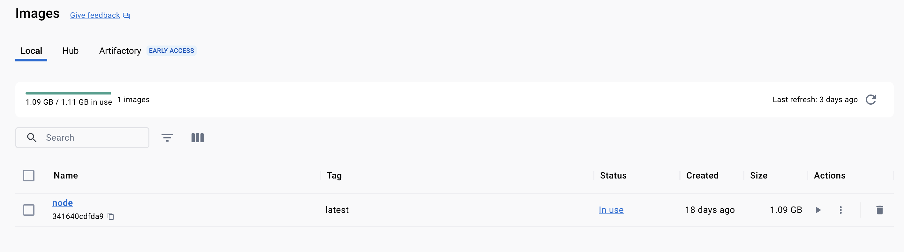
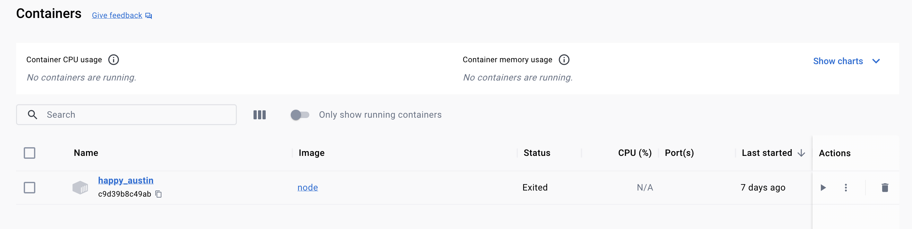

# Deleting Docker `Images` and `Containers`

## Listing Containers
We can get the list of the container running
```shell
docker ps
```

```shell-output
docker ps   
CONTAINER ID   IMAGE     COMMAND   CREATED   STATUS    PORTS     NAMES
```

Or the list of all container (included stopped) using:
```shell
docker ps -a
```

```shell-output
docker ps -a
CONTAINER ID   IMAGE          COMMAND                  CREATED        STATUS                    PORTS     NAMES
5510dd2cbfd8   6e8835357e5c   "python rng.py"          22 hours ago   Exited (0) 22 hours ago             unruffled_blackburn
11d60cef9b50   6e8835357e5c   "python rng.py"          22 hours ago   Exited (1) 22 hours ago             gracious_diffie
dfc6adb4d356   aaab7435aa4a   "docker-entrypoint.s…"   2 days ago     Exited (137) 2 days ago             sweet_fermat
66d1353bba0b   aaab7435aa4a   "docker-entrypoint.s…"   6 days ago     Exited (137) 5 days ago             admiring_allen
7f35b565b5a7   aaab7435aa4a   "docker-entrypoint.s…"   6 days ago     Exited (137) 6 days ago             festive_rosalind
16a254c850a7   node           "docker-entrypoint.s…"   7 days ago     Exited (0) 7 days ago               infallible_boyd
f20ff427371d   node           "docker-entrypoint.s…"   7 days ago     Exited (0) 7 days ago               objective_solomon
c9d39b8c49ab   node           "docker-entrypoint.s…"   7 days ago     Exited (0) 7 days ago               happy_austin
```

## Deleting `Containers`
When deleting a container, first we need to stop the container (if it is running) with `docker stop [container:id/name]`

### Single One

and then we can delete it using `docker rm [container:is/name]`

```shell
docker rm 5510dd2cbfd8
```

```shell-output
docker rm 5510dd2cbfd8
5510dd2cbfd8


docker ps -a          
CONTAINER ID   IMAGE          COMMAND                  CREATED        STATUS                    PORTS     NAMES
11d60cef9b50   6e8835357e5c   "python rng.py"          22 hours ago   Exited (1) 22 hours ago             gracious_diffie
dfc6adb4d356   aaab7435aa4a   "docker-entrypoint.s…"   2 days ago     Exited (137) 2 days ago             sweet_fermat
66d1353bba0b   aaab7435aa4a   "docker-entrypoint.s…"   6 days ago     Exited (137) 5 days ago             admiring_allen
7f35b565b5a7   aaab7435aa4a   "docker-entrypoint.s…"   6 days ago     Exited (137) 6 days ago             festive_rosalind
16a254c850a7   node           "docker-entrypoint.s…"   7 days ago     Exited (0) 7 days ago               infallible_boyd
f20ff427371d   node           "docker-entrypoint.s…"   7 days ago     Exited (0) 7 days ago               objective_solomon
c9d39b8c49ab   node           "docker-entrypoint.s…"   7 days ago     Exited (0) 7 days ago               happy_austin
```

### Multiple Containers 

To remove more than one we can also send additional name(s) / id(s)
`docker rm container-one container-two container-three`

```shell
docker rm 11d60cef9b50 sweet_fermat 66d1353bba0b 
```

```shell-output
docker ps -a                                    
CONTAINER ID   IMAGE          COMMAND                  CREATED      STATUS                    PORTS     NAMES
7f35b565b5a7   aaab7435aa4a   "docker-entrypoint.s…"   7 days ago   Exited (137) 6 days ago             festive_rosalind
16a254c850a7   node           "docker-entrypoint.s…"   7 days ago   Exited (0) 7 days ago               infallible_boyd
f20ff427371d   node           "docker-entrypoint.s…"   7 days ago   Exited (0) 7 days ago               objective_solomon
c9d39b8c49ab   node           "docker-entrypoint.s…"   7 days ago   Exited (0) 7 days ago               happy_austin
```

Or all at once:

```shell
docker container prune
```


## Managing Docker `Images`
To list all the images, we can execute:

```shell
docker images
```

```shell-output
docker images
REPOSITORY   TAG       IMAGE ID       CREATED        SIZE
<none>       <none>    6e8835357e5c   22 hours ago   1.01GB
<none>       <none>    62d1fc18e4fd   6 days ago     1.1GB
<none>       <none>    3e27fd0f14df   6 days ago     1.1GB
<none>       <none>    e9af95cd4351   6 days ago     1.1GB
<none>       <none>    aaab7435aa4a   7 days ago     1.1GB
node         latest    341640cdfda9   2 weeks ago    1.1GB
```

If we want to remove one or more images we can execute:
>NOTE: As long as there aren't containers either `stopped` or `running`, 
> otherwise, first the container must be removed.

```shell-example
docker rmi [image:id/name]
docker rmi [image1:id/name] [image2:id/name] [image3:id/name] [image4:id/name]
```

```shell
docker rmi 6e8835357e5c
```

```shell-output
docker rmi 6e8835357e5c
Deleted: sha256:6e8835357e5c1846fe2087e0d8260b253ede10d31f5c40a09b53c6c24650b06d
```

If we want to remove **all** `images` not being used by containers we can execute:

```shell
docker image prune
```


# After the `Container` & `Images` Clean-up

```shell-output
docker images
REPOSITORY   TAG       IMAGE ID       CREATED       SIZE
node         latest    341640cdfda9   2 weeks ago   1.1GB

docker ps -a 
CONTAINER ID   IMAGE     COMMAND                  CREATED      STATUS                  PORTS     NAMES
c9d39b8c49ab   node      "docker-entrypoint.s…"   7 days ago   Exited (0) 7 days ago             happy_austin
```



