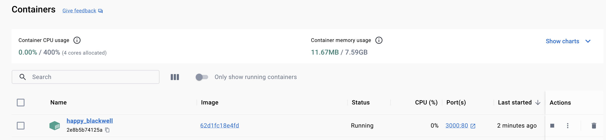
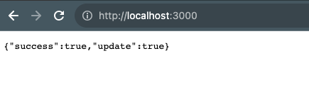
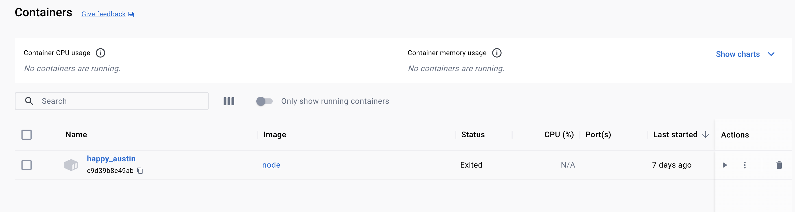

# Removing Container when Stopped

If we list the `help` for `run` command:
```shell
docker run --help
``` 

we can find the `-rm` flag which means:

```shell-output
 --rm   Automatically remove the container when it exits
```

```shell-example
docker run [container:id/name] -rm
```

First we will create an `image` and start a `container` using `-rm` flag:


1. On port `3000` with `-p 3000:80`
2. In `detached` mode with `-d`
3. And finally with `--rm` to remove it when we stopped it.

```shell
 docker run -p 3000:80 -d --rm 62d1fc18e4fd
```

```shell-output
docker run -p 3000:80 -d --rm 62d1fc18e4fd
2e8b5b74125aadc9a41630d6f38fc344e30355e6a83deb8e3c0ac9b9a6995118
docker ps  

CONTAINER ID   IMAGE          COMMAND                  CREATED         STATUS         PORTS                  NAMES
2e8b5b74125a   62d1fc18e4fd   "docker-entrypoint.s…"   6 seconds ago   Up 5 seconds   0.0.0.0:3000->80/tcp   happy_blackwell
```





If we stp the container  with `docker stop [container:id/name]`

```shell
docker stop 2e8b5b74125a
```
The container won't be listed since it was removed when we stopped it.

```shell-output
docker ps -a            
CONTAINER ID   IMAGE     COMMAND                  CREATED      STATUS                  PORTS     NAMES
c9d39b8c49ab   node      "docker-entrypoint.s…"   7 days ago   Exited (0) 7 days ago             happy_austin
```

