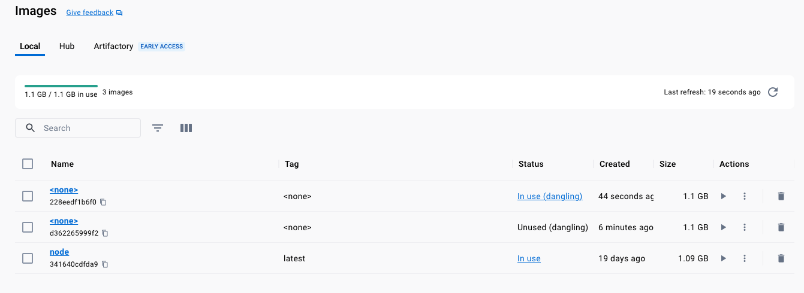
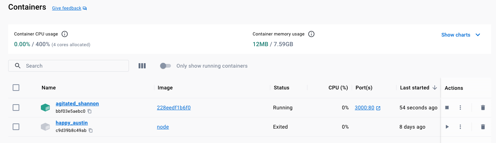
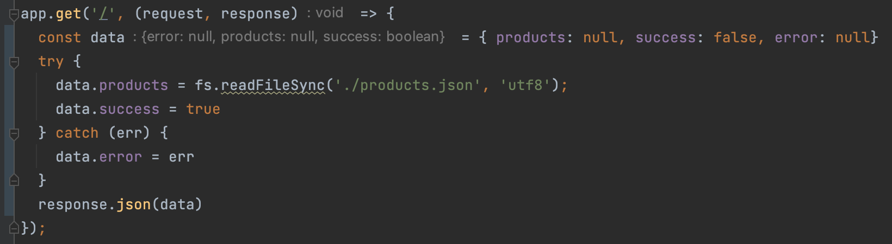
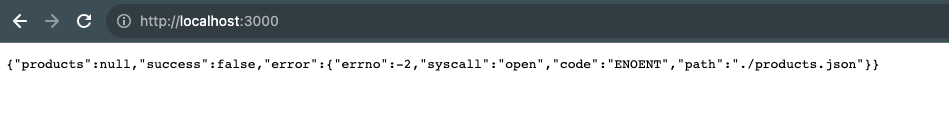
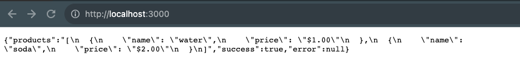
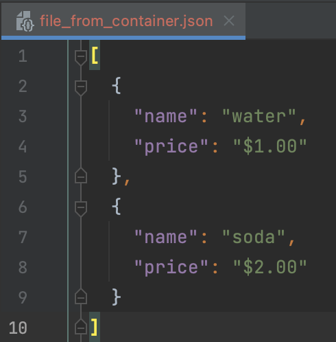

# Copying files `from` and `to` a `Container`

Docker provides the `cp` command that stand for `copy`, it allows to copy files `from` and `to` a 
container `docker cp [local_path] [container:id/name]:[container_path]`

```shell
docker build .
docker images
```

```shell-output
docker images 
REPOSITORY   TAG       IMAGE ID       CREATED          SIZE
<none>       <none>    228eedf1b6f0   18 seconds ago   1.1GB
<none>       <none>    d362265999f2   5 minutes ago    1.1GB
node         latest    341640cdfda9   2 weeks ago      1.1GB
```

```shell
docker run -p 3000:80 -d 228eedf1b6f0
```










## Copying the `products.json` file `Into` the Container

```shell-output
docker ps
CONTAINER ID   IMAGE          COMMAND                  CREATED         STATUS              PORTS                  NAMES
bbf03e5aebc0   228eedf1b6f0   "docker-entrypoint.s…"   2 minutes ago   Up About a minute   0.0.0.0:3000->80/tcp   agitated_shannon
```

```shell
docker cp mock-data/. bbf03e5aebc0:/app
```

```shell-output
docker cp mock-data/. bbf03e5aebc0:/app
Successfully copied 2.56kB to bbf03e5aebc0:/app
```



## Copying the `products.json` `from` the Container `into` the Local FS.

We can get the file from the container, this will create a new folder in the `local` file system with the json file
that previously we copied into the container, `docker cp [container:id/name]:[container_path] [local_path]`

```shell
docker cp bbf03e5aebc0:/app/products.json ./file_from_container.json
```



> NOTE: this is useful to change content inside a container (like source code) while avoiding the step to rebuild the 
> image and then re-run the container, there are better ways to handle this but this is a possible option, we can retrieve
> logs, inject mock data, etc. 
