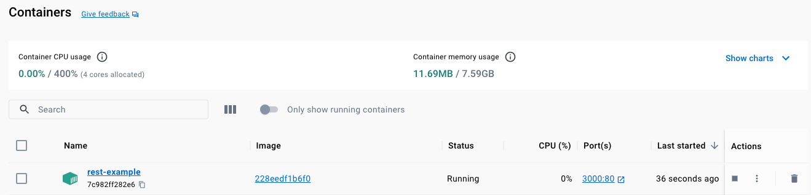
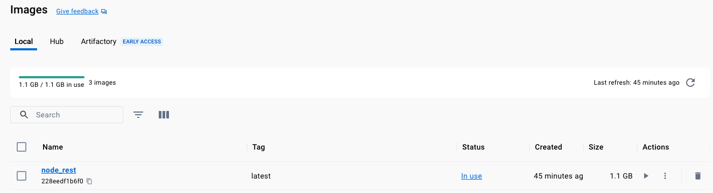
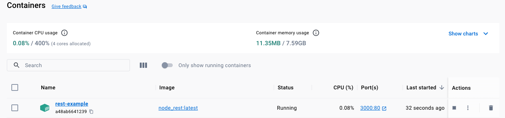

# Names & Tags

## Naming a `Container`

We can assign a `name` to a container (instead of using the autogenerated) if we pass the
`--name` flag `docker run --name my_container [image:id/name]`

```shell
docker run -p 3000:80 -d --name rest-example 228eedf1b6f0
```



```shell-output
docker ps   
CONTAINER ID   IMAGE          COMMAND                  CREATED              STATUS              PORTS                  NAMES
7c982ff282e6   228eedf1b6f0   "docker-entrypoint.s…"   About a minute ago   Up About a minute   0.0.0.0:3000->80/tcp   rest-example
```

## Naming and Tagging an `Image`

When we build images we can also provide a `tag` (similar to a `name` in the container) to have a better control
The tag consists of 2 parts `[repository:tag]` for example `NODE` image the repository is `node` and tag is `latest`

```shell-output
docker images
REPOSITORY   TAG       IMAGE ID       CREATED          SIZE
node         latest    341640cdfda9   2 weeks ago      1.1GB
```

These 2 values combined will give you a unique identifier

```shell
docker build -t my_image:latest .
```

```shell-output
docker build -t node_rest:latest .
[+] Building 0.1s (10/10) FINISHED                                                                                                                                                         docker:desktop-linux
 => [internal] load .dockerignore                                                                                                                                                                          0.0s
 => => transferring context: 2B                                                                                                                                                                            0.0s
 => [internal] load build definition from Dockerfile                                                                                                                                                       0.0s
 => => transferring dockerfile: 890B                                                                                                                                                                       0.0s
 => [internal] load metadata for docker.io/library/node:latest                                                                                                                                             0.0s
 => [1/5] FROM docker.io/library/node                                                                                                                                                                      0.0s
 => [internal] load build context                                                                                                                                                                          0.0s
 => => transferring context: 90B                                                                                                                                                                           0.0s
 => CACHED [2/5] WORKDIR /app                                                                                                                                                                              0.0s
 => CACHED [3/5] COPY package.json /app                                                                                                                                                                    0.0s
 => CACHED [4/5] RUN npm install                                                                                                                                                                           0.0s
 => CACHED [5/5] COPY . /app                                                                                                                                                                               0.0s
 => exporting to image                                                                                                                                                                                     0.0s
 => => exporting layers                                                                                                                                                                                    0.0s
 => => writing image sha256:228eedf1b6f0dac1b3699fffda540b9867fa79b02c6fe5e847a561b725ce250e                                                                                                               0.0s
 => => naming to docker.io/library/node_rest:latest                          
```



```shell
docker run -p 3000:80 -d --name rest-example node_rest:latest
```



If you want to remove all images including those which were tagged
```shell
docker image prune -a
```
