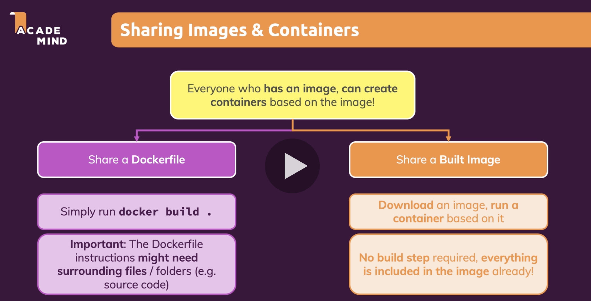
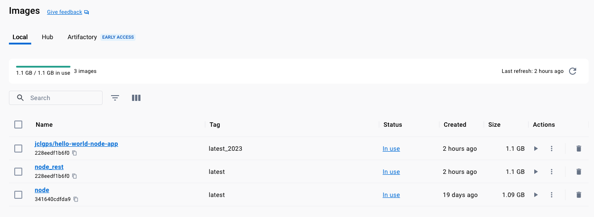
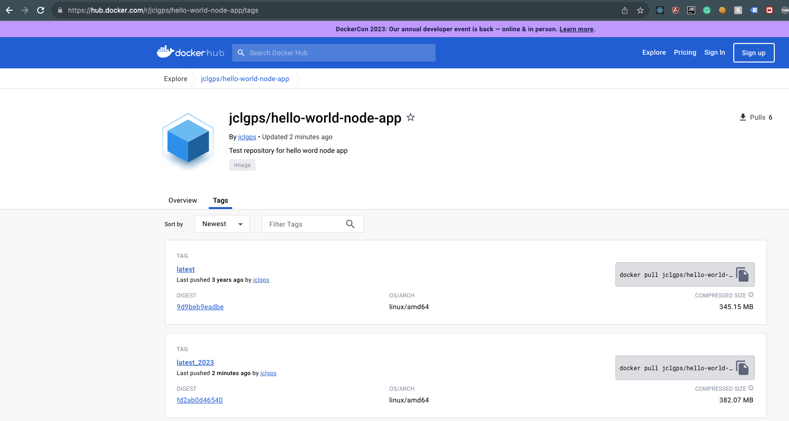

# Sharing images from Docker hub or Private Registry



First step, we need to create an account in [docker hub](https://hub.docker.com/) or any private image registry. 
Then we can log in to docker using our credentials

```shell
docker login
```

We can use the repository name that we created in docker hub to push our images
but, first we need to tag the image to the corresponding repository
if we already have an existing image we can creat a `re-tagged` clone.

```shell-output
docker images
REPOSITORY   TAG       IMAGE ID       CREATED       SIZE
node_rest    latest    228eedf1b6f0   2 hours ago   1.1GB
node         latest    341640cdfda9   2 weeks ago   1.1GB
```

We will tag image "228eedf1b6f0" to a new repository
```shell
docker tag 228eedf1b6f0 jclgps/hello-world-node-app:latest_2023
```

```shell-output
docker images                                                  
REPOSITORY                    TAG           IMAGE ID       CREATED       SIZE
jclgps/hello-world-node-app   latest_2023   228eedf1b6f0   2 hours ago   1.1GB
node_rest                     latest        228eedf1b6f0   2 hours ago   1.1GB
node                          latest        341640cdfda9   2 weeks ago   1.1GB
```

> NOTE: When we use the `id` the image will be updated, if we use an existing tag (like in this case),
> the image will get cloned.


With an `image` tagged as we expect for our `repository`, in this case `jclgps/hello-world-node-app:latest_2023`
we can proceed and push this image to the docker hub registry

```shell
docker push jclgps/hello-world-node-app:latest_2023
```



```shell-output
docker push jclgps/hello-world-node-app:latest_2023
The push refers to repository [docker.io/jclgps/hello-world-node-app]
24d14b4a39fb: Pushed 
90da669dd000: Pushing [==================================================>]  7.278MB
8e1a1b27a32f: Pushed 
ac219f6ccfb0: Pushed 
cb591dd771d8: Mounted from library/node 
488ed91819d9: Mounted from library/node 
7e98a34e8d5d: Waiting 
59c677849659: Waiting 
b485c6cd33a6: Waiting 
6aa872026017: Waiting 
43ba18a5eaf8: Waiting 
ff61a9b258e5: Waiting 

...

docker push jclgps/hello-world-node-app:latest_2023
The push refers to repository [docker.io/jclgps/hello-world-node-app]
24d14b4a39fb: Pushed 
90da669dd000: Pushed 
8e1a1b27a32f: Pushed 
ac219f6ccfb0: Pushed 
cb591dd771d8: Mounted from library/node 
488ed91819d9: Mounted from library/node 
7e98a34e8d5d: Mounted from library/node 
59c677849659: Mounted from library/node 
b485c6cd33a6: Mounted from library/python 
6aa872026017: Mounted from library/python 
43ba18a5eaf8: Mounted from library/python 
ff61a9b258e5: Mounted from library/python 
latest_2023: digest: sha256:fd2ab0d46540fe0c630c16e15e39d3ec705f3190d5d273ad2654c2718dff3aee size: 2835
```


