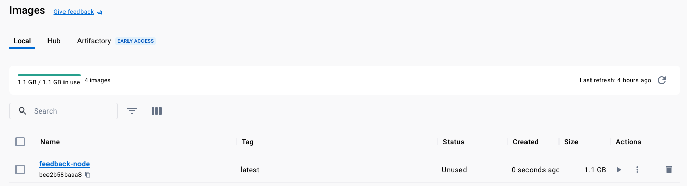
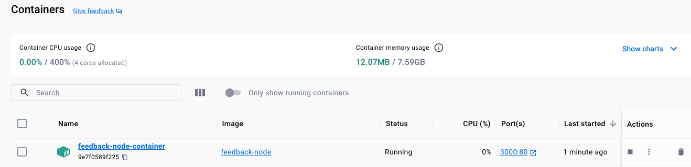
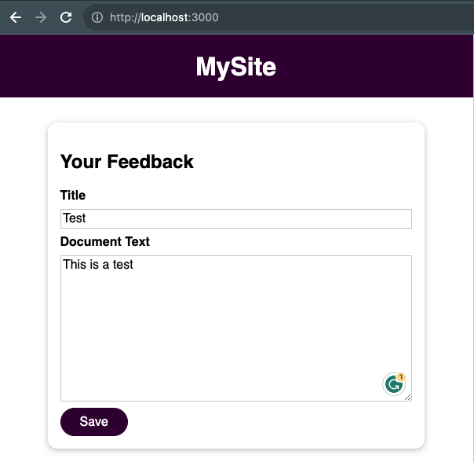
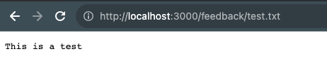
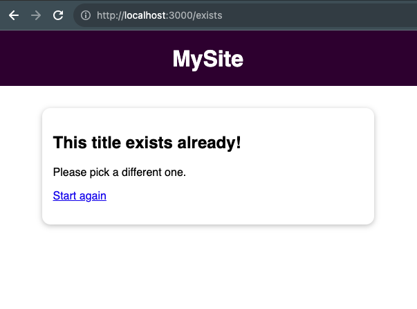
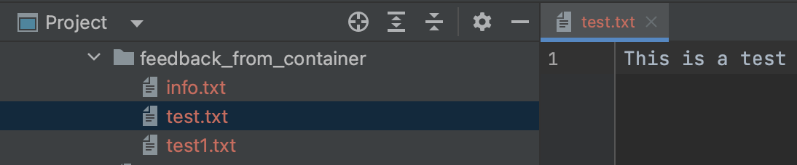

# Creating the Docker file

We first build the Docker file by checking the application code, ports, etc and we build the image:
```shell
docker build -t feedback-node .
```

```shell-output
[+] Building 3.3s (10/10) FINISHED                                                                                                                                                         docker:desktop-linux
 => [internal] load .dockerignore                                                                                                                                                                          0.0s
 => => transferring context: 2B                                                                                                                                                                            0.0s
 => [internal] load build definition from Dockerfile                                                                                                                                                       0.0s
 => => transferring dockerfile: 163B                                                                                                                                                                       0.0s
 => [internal] load metadata for docker.io/library/node:latest                                                                                                                                             0.0s
 => [1/5] FROM docker.io/library/node                                                                                                                                                                      0.0s
 => [internal] load build context                                                                                                                                                                          0.0s
 => => transferring context: 4.70kB                                                                                                                                                                        0.0s
 => CACHED [2/5] WORKDIR /app                                                                                                                                                                              0.0s
 => [3/5] COPY demo-app/package.json .                                                                                                                                                                     0.0s
 => [4/5] RUN npm install                                                                                                                                                                                  2.9s
 => [5/5] COPY demo-app .                                                                                                                                                                                  0.0s
 => exporting to image                                                                                                                                                                                     0.2s
 => => exporting layers                                                                                                                                                                                    0.2s
 => => writing image sha256:bee2b58baaa8af08234a9a3a39c77ca638e0f8025ba661c4e9d03b9a642241be                                                                                                               0.0s
 => => naming to docker.io/library/feedback-node           
```

We can verify the image created:
```shell
docker images
```

```shell-output
docker images                  
REPOSITORY                    TAG           IMAGE ID       CREATED         SIZE
feedback-node                 latest        bee2b58baaa8   2 minutes ago   1.1GB
```



Then with the `image` created we `run` as:

```shell
docker run -p 3000:80 --name feedback-node-container feedback-node
```

And the container should be running port 3000 on local machine:

```shell-output
 docker ps
CONTAINER ID   IMAGE           COMMAND                  CREATED          STATUS          PORTS                  NAMES
9e7f0589f225   feedback-node   "docker-entrypoint.s…"   45 seconds ago   Up 45 seconds   0.0.0.0:3000->80/tcp   feedback-node-container
```



> NOTE: The downside of this way of persisting data is that, if you ran with `-rm` as soon as the container is stopped, 
> it will be removed, and your `"feedback/*"` files will be removed along with it.







## Retrieving the "feedback" folder from the container

```shell-output
docker ps -a
CONTAINER ID   IMAGE              COMMAND                  CREATED          STATUS                       PORTS     NAMES
9e7f0589f225   feedback-node      "docker-entrypoint.s…"   16 minutes ago   Exited (137) 2 minutes ago             feedback-node-container
```

```shell
docker cp 9e7f0589f225:app/feedback/ ./feedback_from_container/ 
```

```shell-output   
Successfully copied 4.61kB to /Users/JCLG/Documents/Code/docker-udemy/3. Managing Data and Working with Volumes/45. Writing a File inside a Container Demo App/feedback_from_container/
```

