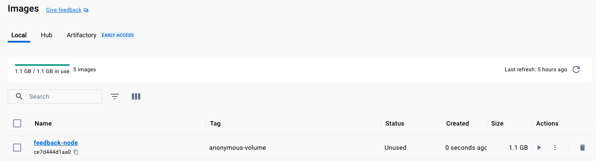

# Anonymous Volumes

Volumes are folder on the host machine (the computer running docker container) that are mounted and mapped
to the running `container`, a `volume` is persisted after `container` is `stopped`, `restarted`, a container can
`read` from and `write` to a `volume`.

## Unmapped Volume to Host Machine

First we will create a volume not mapped to the local machine (this type of volume gets removed when the container 
is deleted)

`VOLUME [ "/app/feedback" ]`

```shell
docker build -t feedback-node:anonymous-volume .
```



```shell-output
docker images
REPOSITORY                    TAG                IMAGE ID       CREATED             SIZE
feedback-node                 anonymous-volume   ce7d444d1aa0   26 seconds ago      1.1GB
```


Then we run the container:

```shell
docker run -d --name feedback-node-container-anonymous-volume -p 3000:80 feedback-node:anonymous-volume
```


```shell-output
docker ps 
CONTAINER ID   IMAGE                            COMMAND                  CREATED          STATUS          PORTS                  NAMES
dcedd103beb3   feedback-node:anonymous-volume   "docker-entrypoint.s…"   15 seconds ago   Up 14 seconds   0.0.0.0:3000->80/tcp   feedback-node-container-anonymous-volume
```


The container will `stop`, we can see the logs with:

```shell
docker logs feedback-node-container-anonymous-volume
```

```shell-output
docker logs feedback-node-container-anonymous-volume                                                   
node:internal/process/promises:289
            triggerUncaughtException(err, true /* fromPromise */);
            ^

[Error: EXDEV: cross-device link not permitted, rename '/app/temp/test.txt' -> '/app/feedback/test.txt'] {
  errno: -18,
  code: 'EXDEV',
  syscall: 'rename',
  path: '/app/temp/test.txt',
  dest: '/app/feedback/test.txt'
}

Node.js v20.5.1

```


## Updating the code

We will change the code from:
```js
  exists(finalFilePath, async (exists) => {
    if (exists) {
        res.redirect('/exists');
    } else {
        await fs.rename(tempFilePath, finalFilePath);
        res.redirect('/');
    }
```
    
To:

```js
  exists(finalFilePath, async (exists) => {
    if (exists) {
        res.redirect('/exists');
    } else {
        await fs.copyFile(tempFilePath, finalFilePath);
        await fs.unlink(tempFilePath);
        res.redirect('/');
    }
```

```shell
docker build -t feedback-node-copy:anonymous-volume .
docker run -d --name feedback-node-container-copy-anonymous-volume -p 3000:80 feedback-node-copy:anonymous-volume
```


## Listing and Inspecting `Volumes`

If we `stop` and `start` now the container keeps the files as long as the container is not removed
(the `volume` remains in the machine, we can use `docker volume ls`), we will change this
limitation with a `named volume`, this is the volume structure when is not directly mapped to a local host directory:


```shell
docker image inspect feedback-node:anonymous-volume
```

```shell-output
"Volumes": {
                "/app/feedback": {}
            },
```

We can list existing volumes with
```shell
docker volume ls
```

```shell-output
DRIVER    VOLUME NAME
local     66fb428e8973c3c68a4147bc4c04fe75a382c98eeee18df97e3a46a786ca4909
```

We can inspect the volume with:

```shell
docker volume inspect 66fb428e8973c3c68a4147bc4c04fe75a382c98eeee18df97e3a46a786ca4909
```

```shell-output
[
    {
        "CreatedAt": "2023-09-05T02:13:30Z",
        "Driver": "local",
        "Labels": {
            "com.docker.volume.anonymous": ""
        },
        "Mountpoint": "/var/lib/docker/volumes/66fb428e8973c3c68a4147bc4c04fe75a382c98eeee18df97e3a46a786ca4909/_data",
        "Name": "66fb428e8973c3c68a4147bc4c04fe75a382c98eeee18df97e3a46a786ca4909",
        "Options": null,
        "Scope": "local"
    }
]

```

> NOTE: Volumes are never deleted unless the parent container is deleted with `docker rm -v [container_id]`
> and there are no other containers using the volume.


We can clean up the volumes
```shell
docker volume --help
```

```shell-output
Usage:  docker volume COMMAND

Manage volumes

Commands:
  create      Create a volume
  inspect     Display detailed information on one or more volumes
  ls          List volumes
  prune       Remove all unused local volumes
  rm          Remove one or more volumes
```
