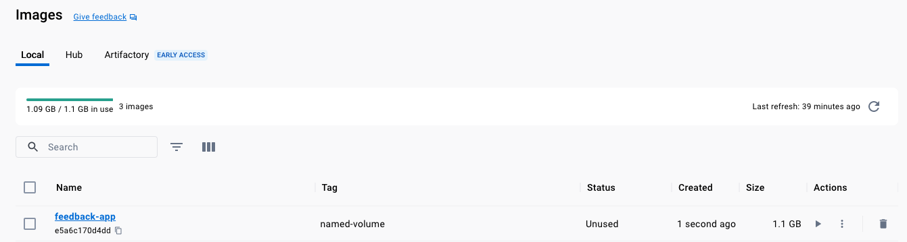
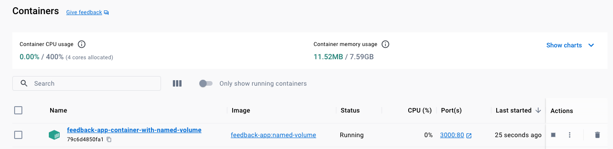
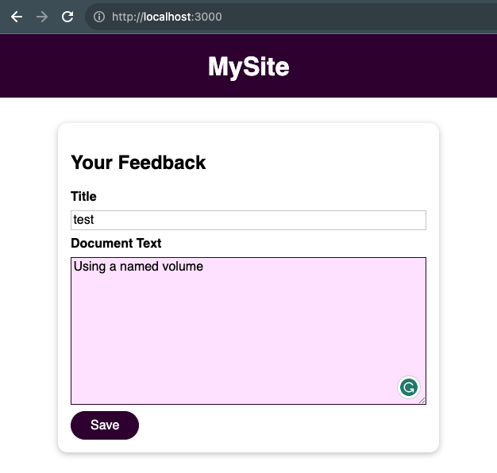
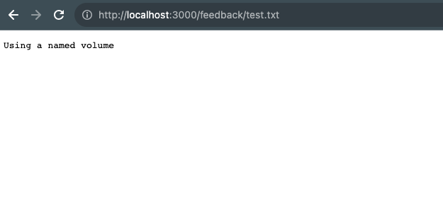
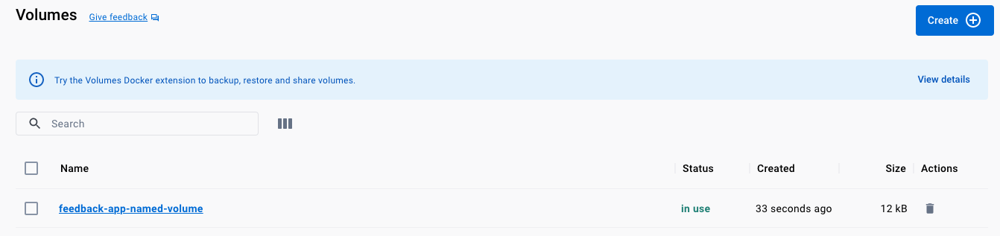
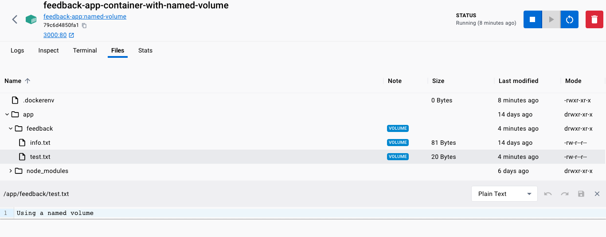
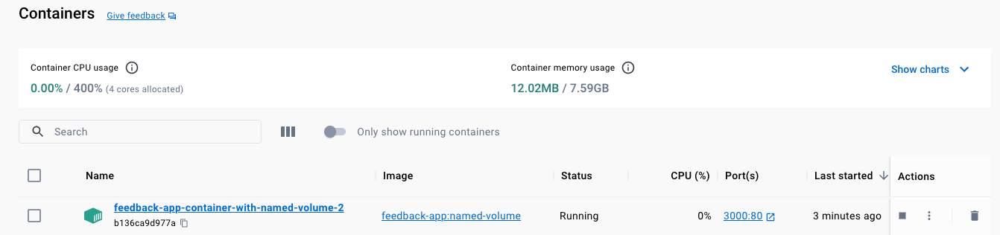

# Named Volumes

Are docker managed `volume` with a name assigned by us, this named `volume` will remain available even 
after a container is removed, this way if we start a new `container` making reference to the same 
`named volume` the previous data will still be available.

## Creating the `image`

```shell
docker build -t feedback-app:named-volume .
```



```shell-output
docker images
REPOSITORY           TAG                IMAGE ID       CREATED          SIZE
feedback-app         named-volume       e5a6c170d4dd   59 seconds ago   1.1GB
```

## Creating the Container

To pass a `named volume` we will use:
- `-v [volume_name]:[container_internal_fs_dir]`

```shell
docker run -d --name feedback-app-container-with-named-volume -p 3000:80 --rm -v feedback-app-named-volume:/app/feedback feedback-app:named-volume
```







## Named Volume

We can list the volume & container
```shell
docker volume ls
```

```shell-output
DRIVER    VOLUME NAME
local     feedback-app-named-volume
```





## Reusing the same `Named Volume`

Since the container was ran with `--rm` when it is `stopped`, it will get `removed`:

```shell-output
docker ps
CONTAINER ID   IMAGE                       COMMAND                  CREATED          STATUS          PORTS                  NAMES
79c6d4850fa1   feedback-app:named-volume   "docker-entrypoint.s…"   10 minutes ago   Up 10 minutes   0.0.0.0:3000->80/tcp   feedback-app-container-with-named-volume
```

```shell
docker stop feedback-app-container-with-named-volume
```

```shell-output
docker ps                                           
CONTAINER ID   IMAGE     COMMAND   CREATED   STATUS    PORTS     NAMES
```

Then we start a new container `feedback-app-container-with-named-volume-2` making reference to the same `named volume`:

```shell
docker run -d --name feedback-app-container-with-named-volume-2 -p 3000:80 --rm -v feedback-app-named-volume:/app/feedback feedback-app:named-volume
```

if send a `GET` Request to `http://localhost:3000/feedback/test.txt`

It will return the first feedback file that was created when we executed the first container, in this case:

1. `feedback-app-container-with-named-volume`: Created the test.txt file into the volume named `feedback-app-named-volume`.
2. `feedback-app-container-with-named-volume-2`: Is able to read what the first container wrote in the `volume` even when it was `deleted`.




After `deleting` the second container too:

```shell
docker stop feedback-app-container-with-named-volume-2
```

We still see the `named volume` and can be used by mapping it to another container:

```shell-output
docker volume ls                                                                                                                                    
DRIVER    VOLUME NAME
local     feedback-app-named-volume
```

> **NOTE**: `volumes` are useful when we need to persist data that we are not directly interacting with or editing,
> this will **not** help us to run for `development` purposes, we will need `bind mounts` for that purpose.
