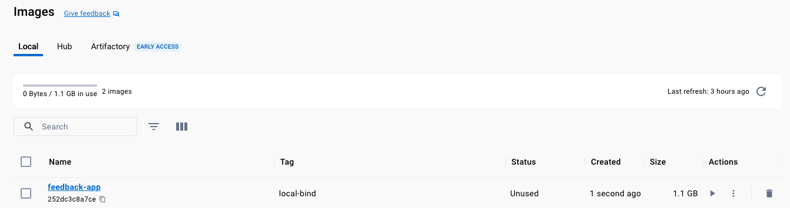
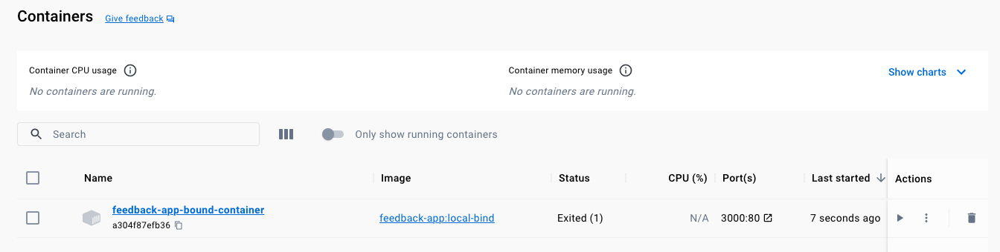
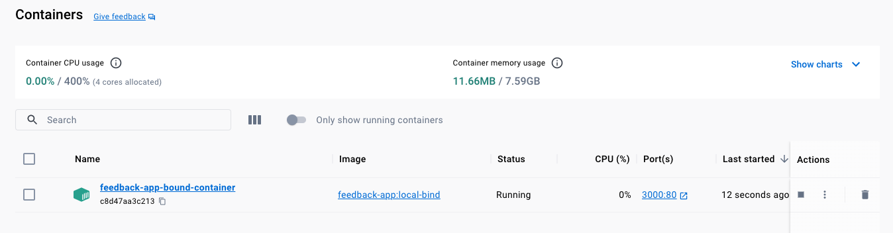
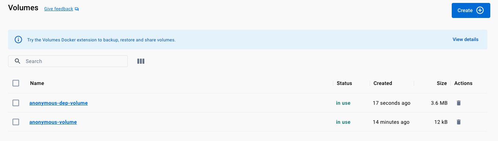
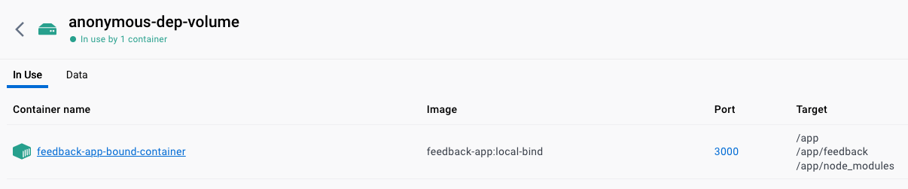
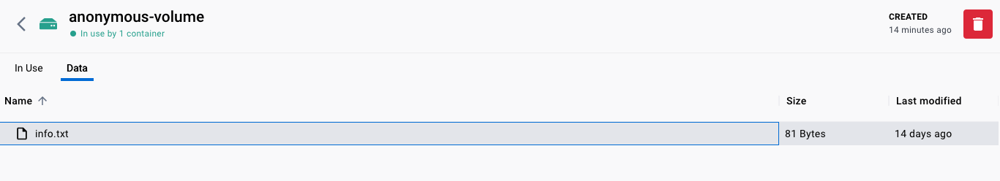
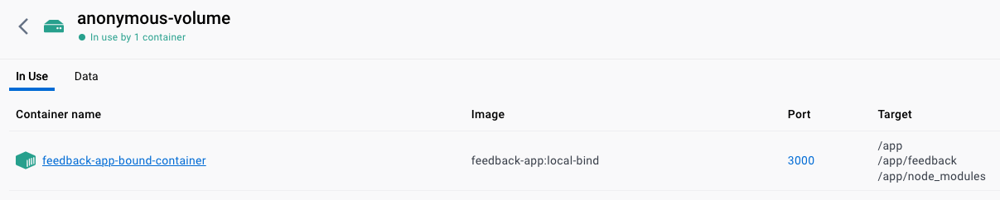
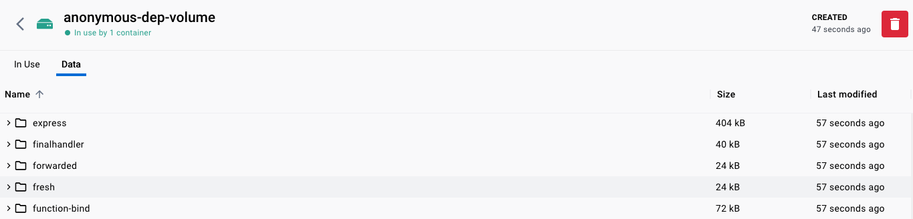
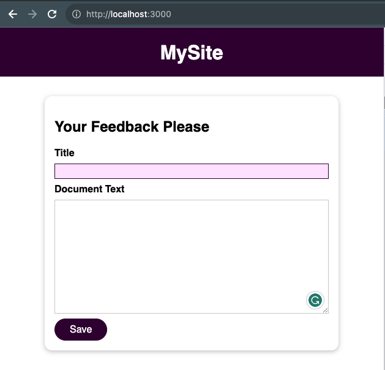
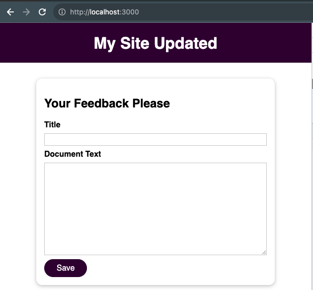

# Bind Mounts

Contrary to `volumes` where the file system is assigned by docker, in a `bind mount` we can control the folder
in the host machine where a specific folder in the `container` will be mapped to, these are great for 
**persistent** and **editable** data.

## Building the `Image`

```shell
docker build -t feedback-app:local-bind .
```



```shell-output
docker images
REPOSITORY     TAG          IMAGE ID       CREATED         SIZE
feedback-app   local-bind   252dc3c8a7ce   6 minutes ago   1.1GB
node           latest       341640cdfda9   3 weeks ago     1.1GB
```

## Mapping a `local` folder to a `container` folder

We can include a `bind mount` as a second volume using `-v [host_file_path]:[container_path]`

```shell-example
macOS/Linux: -v $(pwd):/app
Windows: -v "%cd%":/app
```

In the following example, we will have an `anonymous volume` to persists `/app/feedback` and a 
`bind volume` to pass reference our local folder where we have the source code:

```shell
docker run -d -p 3000:80 --name feedback-app-bound-container -v anonymous-volume:/app/feedback -v "$(pwd)/demo-app:/app" feedback-app:local-bind
```



```shell-output
docker ps -a
CONTAINER ID   IMAGE                     COMMAND                  CREATED              STATUS                          PORTS     NAMES
a304f87efb36   feedback-app:local-bind   "docker-entrypoint.s…"   About a minute ago   Exited (1) About a minute ago             feedback-app-bound-container
```

```shell-output
docker logs feedback-app-bound-container                                                                                                        
node:internal/modules/cjs/loader:1051
  throw err;
  ^

Error: Cannot find module 'express'
Require stack:
- /app/server.js
    at Module._resolveFilename (node:internal/modules/cjs/loader:1048:15)
    at Module._load (node:internal/modules/cjs/loader:901:27)
    at Module.require (node:internal/modules/cjs/loader:1115:19)
    at require (node:internal/modules/helpers:130:18)
    at Object.<anonymous> (/app/server.js:5:17)
    at Module._compile (node:internal/modules/cjs/loader:1233:14)
    at Module._extensions..js (node:internal/modules/cjs/loader:1287:10)
    at Module.load (node:internal/modules/cjs/loader:1091:32)
    at Module._load (node:internal/modules/cjs/loader:938:12)
    at Function.executeUserEntryPoint [as runMain] (node:internal/modules/run_main:83:12) {
  code: 'MODULE_NOT_FOUND',
  requireStack: [ '/app/server.js' ]
}

Node.js v20.5.1
```

The reason for this error is that when plug the `bind mount`, we are replacing the `"/app"` folder content that was 
created when we `built` the `image`, all the `node_modules` required to run are gone and the application can't start.

## Preserving `node_modules` with a 3rd `volume`

Docker will keep the most specific `path` when there is a clash, in this case:

1. `$(pwd)/demo-app:/app`
2. `/app/node_modules`

From these 2 volumes, `/app/node_modules` will be kept as an anonymous volume with what comes along when the image was built, 
hence the `node_modules` folder created inside the container will be available. Now if we change something in the bind mount, it should reflect on the running application

```shell
docker run -d -p 3000:80 --name feedback-app-bound-container -v anonymous-volume:/app/feedback -v anonymous-dep-volume:/app/node_modules -v "$(pwd)/demo-app:/app" feedback-app:local-bind
```













## Updating the `src` code



Updating the code from:

```html
    <header>
      <h1><a href="/">MySite</a></h1>
    </header>
```

to:

```html
    <header>
      <h1><a href="/">My Site Updated</a></h1>
    </header>
```

without rebuilding the docker `image`:

