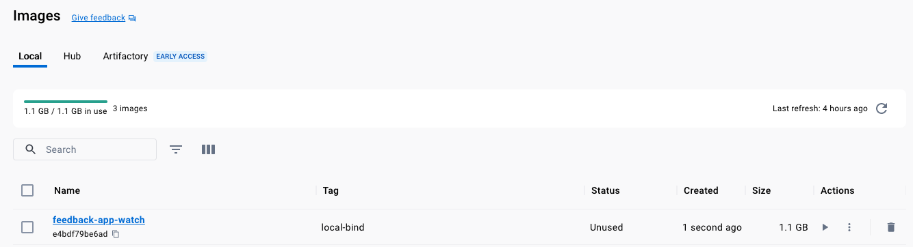
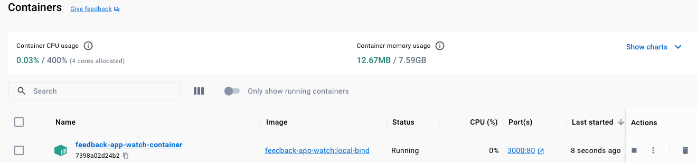
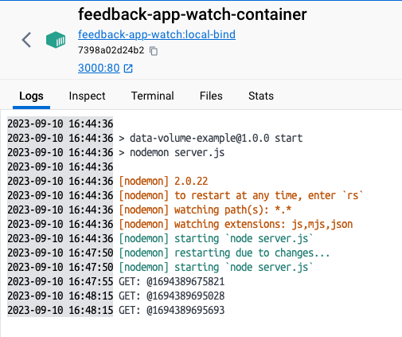

# Bind Mount

We will include a new dependency `nodemon` to auto-watch over source code:

```json
   "scripts": {
       "start": "nodemon server.js"
   },
   ...
   "devDependencies": {
       "nodemon": "^2.0.4"
   }
```

```dockerfile
CMD ["npm", "start"]
```


## Building our `image` and `container`

```shell
docker build -t feedback-app-watch:local-bind .
```

```shell-output
docker images
REPOSITORY           TAG          IMAGE ID       CREATED             SIZE
feedback-app-watch   local-bind   e4bdf79be6ad   27 seconds ago      1.1GB
```



```shell
docker run -d -p 3000:80 --name feedback-app-watch-container -v demo-app-volume:/app/feedback -v "$(pwd)/demo-app:/app" -v /app/node_modules  feedback-app-watch:local-bind
```



```shell-output
docker ps
CONTAINER ID   IMAGE                           COMMAND                  CREATED          STATUS          PORTS                  NAMES
7398a02d24b2   feedback-app-watch:local-bind   "docker-entrypoint.s…"   59 seconds ago   Up 58 seconds   0.0.0.0:3000->80/tcp   feedback-app-watch-container
```

## Modifying `server.js`

Updating the `js` code to generate logs on the server:

```js
app.get('/', (req, res) => {
  const filePath = path.join(__dirname, 'pages', 'feedback.html');
  res.sendFile(filePath);
});
```

to:

```js
app.get('/', (req, res) => {
  console.log(`GET: @${Date.now()}`)
  const filePath = path.join(__dirname, 'pages', 'feedback.html');
  res.sendFile(filePath);
});
```



```shell-output
docker logs feedback-app-watch-container

> data-volume-example@1.0.0 start
> nodemon server.js

[nodemon] 2.0.22
[nodemon] to restart at any time, enter `rs`
[nodemon] watching path(s): *.*
[nodemon] watching extensions: js,mjs,json
[nodemon] starting `node server.js`
[nodemon] restarting due to changes...
[nodemon] starting `node server.js`
GET: @1694389675821
GET: @1694389695028
GET: @1694389695693
```
