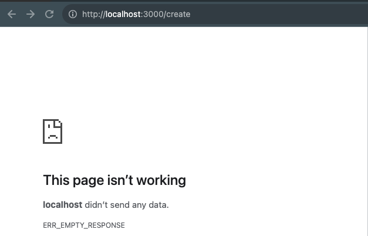
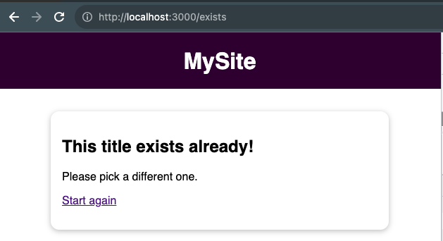

# Read Only `Volume`

We specify with `[host_path]:[container:path]:ro` that we want this volume as **READ ONLY** however since the 
`temp` folder is part of the folder we marked as **READ ONLY** will fail at write time:

```shell
docker build -t feedback-app-watch-ro:bind-local .
```

```shell
docker run -d -p 3000:80 --name feedback-app-watch-container-read-only -v /app/feedback -v /app/node_modules -v "$(pwd)/demo-app:/app:ro" --rm feedback-app-watch-ro:bind-local
```

```shell-output
docker ps
CONTAINER ID   IMAGE                              COMMAND                  CREATED          STATUS          PORTS                  NAMES
a096eeade9b4   feedback-app-watch-ro:bind-local   "docker-entrypoint.s…"   34 seconds ago   Up 34 seconds   0.0.0.0:3000->80/tcp   feedback-app-watch-container-read-only


docker logs a096eeade9b4
> data-volume-example@1.0.0 start
> nodemon server.js

[nodemon] 2.0.22
[nodemon] to restart at any time, enter `rs`
[nodemon] watching path(s): *.*
[nodemon] watching extensions: js,mjs,json
[nodemon] starting `node server.js`
node:internal/process/promises:289
            triggerUncaughtException(err, true /* fromPromise */);
            ^

[Error: EROFS: read-only file system, open '/app/temp/test.txt'] {
  errno: -30,
  code: 'EROFS',
  syscall: 'open',
  path: '/app/temp/test.txt'
}

Node.js v20.5.1
[nodemon] app crashed - waiting for file changes before starting...
```



## Specific `path` in volume to enable `write` access
we need to use a more specific volume to bypass the `read only` restriction and `write` to it using `-v /app/temp`

```shell
docker run -d -p 3000:80 --name feedback-app-watch-container-read-only -v /app/temp -v /app/feedback -v /app/node_modules -v "$(pwd)/demo-app:/app:ro" --rm feedback-app-watch-ro:bind-local
```

```shell-output
 docker ps               
CONTAINER ID   IMAGE                              COMMAND                  CREATED              STATUS              PORTS                  NAMES
6b24d9099192   feedback-app-watch-ro:bind-local   "docker-entrypoint.s…"   About a minute ago   Up About a minute   0.0.0.0:3000->80/tcp   feedback-app-watch-container-read-only


docker logs 6b24d9099192
> data-volume-example@1.0.0 start
> nodemon server.js

[nodemon] 2.0.22
[nodemon] to restart at any time, enter `rs`
[nodemon] watching path(s): *.*
[nodemon] watching extensions: js,mjs,json
[nodemon] starting `node server.js`
```

