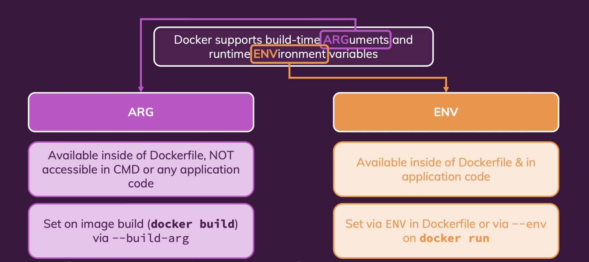
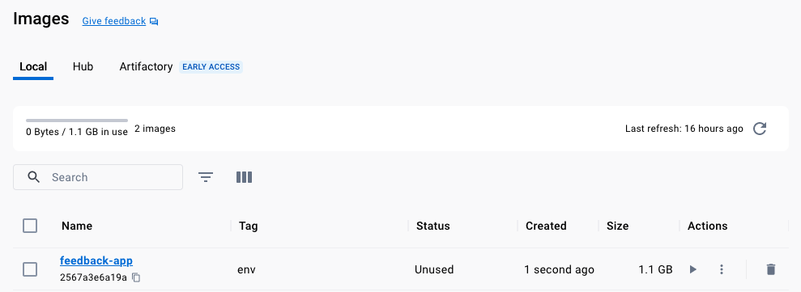
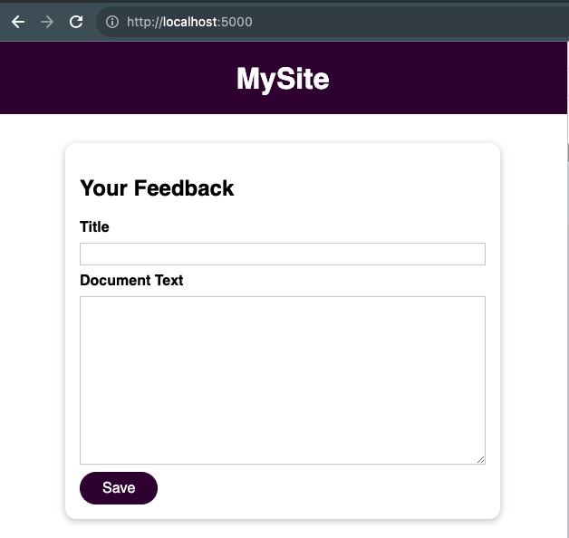
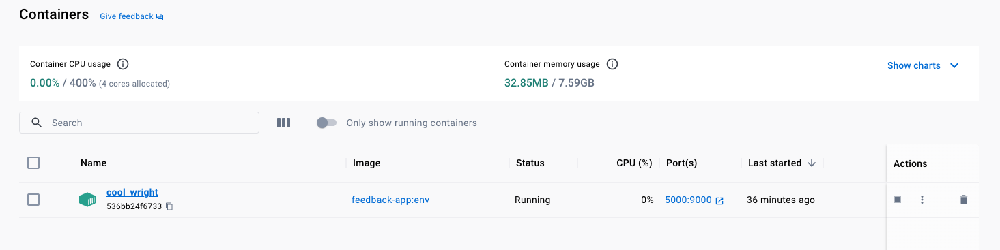

# Environment Variables & `.env` Files.



## Exposing and Reading Variables
First we will forward the `PORT` env variable using the `--env` or `-e` to 
make the value available to the Docker file `ENV PORT` when we run the container.

An `ENV` variable will be available in Docker file where if we pass the value, the image
will use it or it will fallback to the default value,: in the example `80`

```dockerfile
ENV PORT 80
EXPOSE $PORT
```

And in the application:
```js
const { PORT } = process.env;
...
app.listen(PORT);
```
 
## Building the `image`

First we build the image that will support to inject `-env` value:

```shell
docker build . --tag feedback-app:env
```



```shell-output
docker images   
REPOSITORY     TAG       IMAGE ID       CREATED          SIZE
feedback-app   env       2567a3e6a19a   30 seconds ago   1.1GB
node           latest    341640cdfda9   4 weeks ago      1.1GB
```

## Passing a value to `$PORT`

We can run and inject the value using the `--env` flag:

```shell
docker run -p 5000:9000 --env PORT=9000 feedback-app:env
```

The application is running on `http://localhost:5000` using our dynamic `port`:



In summary, the internal port was set to `9000` and then mapped to `5000` outside in the container:

```shell-output
-p 5000:9000 --env PORT=9000
```




## Using `ENV` files
We can also specify an `ENV` file where we have all the values that we want 
to send instead of multiple `--env ONE=1 -e TWO=2` statements in the `cli`:

1. `.env` file:
```env
PORT=9000
```

2. Docker `command`:
```shell
docker run -p 5000:9000 --env-file ./.env feedback-app:env
```


## `Image` History
we can see the `ENV` values for the image using

```shell
docker history feedback-app:env
```

```shell-output
docker history feedback-app:env
IMAGE          CREATED          CREATED BY                                      SIZE      COMMENT
2567a3e6a19a   52 minutes ago   CMD ["npm" "start"]                             0B        buildkit.dockerfile.v0
<missing>      52 minutes ago   COPY demo-app . # buildkit                      4.02kB    buildkit.dockerfile.v0
<missing>      52 minutes ago   RUN /bin/sh -c npm install # buildkit           6.48MB    buildkit.dockerfile.v0
<missing>      52 minutes ago   COPY demo-app/package.json . # buildkit         310B      buildkit.dockerfile.v0
<missing>      52 minutes ago   EXPOSE map[80/tcp:{}]                           0B        buildkit.dockerfile.v0
<missing>      52 minutes ago   ENV PORT=80                                     0B        buildkit.dockerfile.v0
<missing>      2 weeks ago      WORKDIR /app                                    0B        buildkit.dockerfile.v0
<missing>      4 weeks ago      /bin/sh -c #(nop)  CMD ["node"]                 0B        
<missing>      4 weeks ago      /bin/sh -c #(nop)  ENTRYPOINT ["docker-entry…   0B        
<missing>      4 weeks ago      /bin/sh -c #(nop) COPY file:4d192565a7220e13…   388B      
<missing>      4 weeks ago      /bin/sh -c set -ex   && for key in     6A010…   7.6MB     
<missing>      4 weeks ago      /bin/sh -c #(nop)  ENV YARN_VERSION=1.22.19     0B        
<missing>      4 weeks ago      /bin/sh -c ARCH= && dpkgArch="$(dpkg --print…   159MB     
<missing>      4 weeks ago      /bin/sh -c #(nop)  ENV NODE_VERSION=20.5.1      0B        
<missing>      4 weeks ago      /bin/sh -c groupadd --gid 1000 node   && use…   8.94kB    
<missing>      4 weeks ago      /bin/sh -c set -ex;  apt-get update;  apt-ge…   587MB     
<missing>      4 weeks ago      /bin/sh -c apt-get update && apt-get install…   177MB     
<missing>      4 weeks ago      /bin/sh -c set -eux;  apt-get update;  apt-g…   48.4MB    
<missing>      4 weeks ago      /bin/sh -c #(nop)  CMD ["bash"]                 0B        
<missing>      4 weeks ago      /bin/sh -c #(nop) ADD file:3a6d159d80cb8abfa…   116MB     
```

## A Note on **Security**
One important note about environment variables and security: 
>Depending on which kind of data you're storing in
your environment variables, you might **not** want to include the secure data directly in your Dockerfile.

Instead, go for a separate environment variables file which is then only used at runtime
(i.e. when you run your container with docker run). Otherwise, the values are **"baked into the image"**
and **everyone** can `read` these values.
