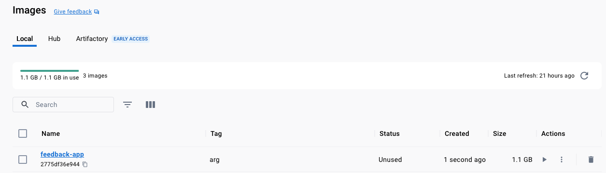
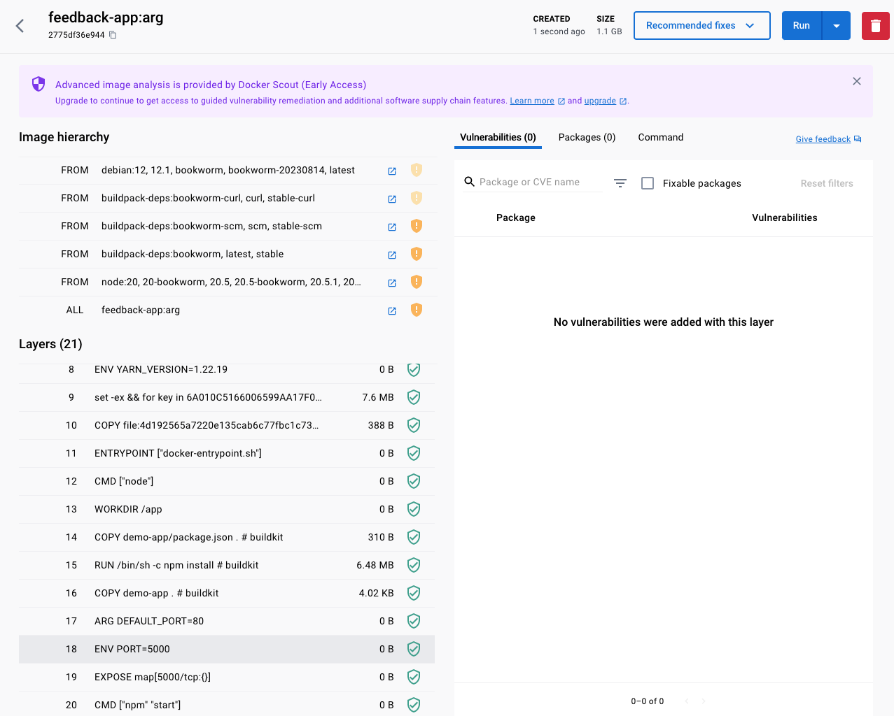

# Build `Image` `ARGuments`

Useful to build images with different values without having to modify the Docker file, these values
are not available at runtime (unless forwarded using `ENV var`) and **can't** be used in all commands
in the Docker file (e.g. `CWD`)

```shell
docker build --tag feedback-app:arg --build-arg DEFAULT_PORT=5000 .
```


## `Image` History

```shell-output
docker history feedback-app:arg
```



```shell-output
docker history feedback-app:arg
IMAGE          CREATED         CREATED BY                                      SIZE      COMMENT
2775df36e944   2 minutes ago   CMD ["npm" "start"]                             0B        buildkit.dockerfile.v0
<missing>      2 minutes ago   EXPOSE map[5000/tcp:{}]                         0B        buildkit.dockerfile.v0
<missing>      2 minutes ago   ENV PORT=5000                                   0B        buildkit.dockerfile.v0
<missing>      2 minutes ago   ARG DEFAULT_PORT=80                             0B        buildkit.dockerfile.v0
<missing>      2 minutes ago   COPY demo-app . # buildkit                      4.02kB    buildkit.dockerfile.v0
<missing>      2 minutes ago   RUN /bin/sh -c npm install # buildkit           6.48MB    buildkit.dockerfile.v0
<missing>      5 hours ago     COPY demo-app/package.json . # buildkit         310B      buildkit.dockerfile.v0
<missing>      3 weeks ago     WORKDIR /app                                    0B        buildkit.dockerfile.v0
<missing>      4 weeks ago     /bin/sh -c #(nop)  CMD ["node"]                 0B        
<missing>      4 weeks ago     /bin/sh -c #(nop)  ENTRYPOINT ["docker-entry…   0B        
<missing>      4 weeks ago     /bin/sh -c #(nop) COPY file:4d192565a7220e13…   388B      
<missing>      4 weeks ago     /bin/sh -c set -ex   && for key in     6A010…   7.6MB     
<missing>      4 weeks ago     /bin/sh -c #(nop)  ENV YARN_VERSION=1.22.19     0B        
<missing>      4 weeks ago     /bin/sh -c ARCH= && dpkgArch="$(dpkg --print…   159MB     
<missing>      4 weeks ago     /bin/sh -c #(nop)  ENV NODE_VERSION=20.5.1      0B        
<missing>      4 weeks ago     /bin/sh -c groupadd --gid 1000 node   && use…   8.94kB    
<missing>      4 weeks ago     /bin/sh -c set -ex;  apt-get update;  apt-ge…   587MB     
<missing>      4 weeks ago     /bin/sh -c apt-get update && apt-get install…   177MB     
<missing>      4 weeks ago     /bin/sh -c set -eux;  apt-get update;  apt-g…   48.4MB    
<missing>      4 weeks ago     /bin/sh -c #(nop)  CMD ["bash"]                 0B        
<missing>      4 weeks ago     /bin/sh -c #(nop) ADD file:3a6d159d80cb8abfa…   116MB     
```

