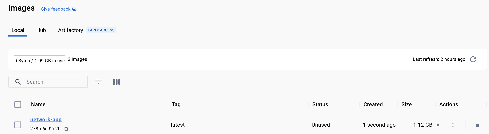

# Network `Container` Communication

### Connection Types:


**From** `Container`'s `code` **to**:
1. To `WWW` as external API `https://swapi.dev/api/*`
> Note: This will work without any configuration.

2. To `host machine` running a process (`mongodb://localhost:27017/swfavorites`) or local WebServer `http://localhost`/`http://127.0.0.1`  
> Note: This will require to use `host.docker.internal` for example `mongodb://host.docker.internal:27017/swfavorites` to successfully establish the connection.

3. To other `container` running in the same `host machine`
> Note: Requires a `Container` network, see module 71 and 73

## Building the `Image` & `Container`

```shell
docker build -t network-app . 
```

```shell-output
docker build -t network-app .
[+] Building 5.6s (10/10) FINISHED                                                                                                                                                         docker:desktop-linux
 => [internal] load build definition from Dockerfile                                                                                                                                                       0.0s
 => => transferring dockerfile: 203B                                                                                                                                                                       0.0s
 => [internal] load .dockerignore                                                                                                                                                                          0.0s
 => => transferring context: 2B                                                                                                                                                                            0.0s
 => [internal] load metadata for docker.io/library/node:latest                                                                                                                                             0.0s
 => [1/5] FROM docker.io/library/node                                                                                                                                                                      0.0s
 => [internal] load build context                                                                                                                                                                          0.0s
 => => transferring context: 3.12kB                                                                                                                                                                        0.0s
 => CACHED [2/5] WORKDIR /app                                                                                                                                                                              0.0s
 => [3/5] COPY app-networks/package.json .                                                                                                                                                                 0.0s
 => [4/5] RUN npm install                                                                                                                                                                                  5.0s
 => [5/5] COPY app-networks .                                                                                                                                                                              0.0s 
 => exporting to image                                                                                                                                                                                     0.5s 
 => => exporting layers                                                                                                                                                                                    0.5s
 => => writing image sha256:278fc6c92c2b3863c2038871405e76740167fa98ab36fa7ffe80385de9c30721                                                                                                               0.0s
 => => naming to docker.io/library/network-app                
```



```shell
docker images
```

```shell-output
docker images
REPOSITORY    TAG       IMAGE ID       CREATED          SIZE
network-app   latest    278fc6c92c2b   30 seconds ago   1.12GB
```

````shell
 docker run -p 3000:3000 --rm network-app
````

### Mongo Error

````shell-output
(node:1) [MONGODB DRIVER] Warning: Current Server Discovery and Monitoring engine is deprecated, and will be removed in a future version. To use the new Server Discover and Monitoring engine, pass option { useUnifiedTopology: true } to the MongoClient constructor.
(Use `node --trace-warnings ...` to show where the warning was created)
MongoNetworkError: failed to connect to server [localhost:27017] on first connect [Error: connect ECONNREFUSED 127.0.0.1:27017
    at TCPConnectWrap.afterConnect [as oncomplete] (node:net:1595:16) {
  name: 'MongoNetworkError'
}]
    at Pool.<anonymous> (/app/node_modules/mongodb/lib/core/topologies/server.js:441:11)
````

### Updating to `host.docker.internal`

```js
mongoose.connect(
  'mongodb://host.docker.internal:27017/swfavorites',
  { useNewUrlParser: true },
  (err) => {
    if (err) {
      console.log(err);
    } else {
      app.listen(3000);
    }
  }
);
```

```shell
docker build -t network-app . 
```

````shell
 docker run -p 3000:3000 --rm network-app
````

```shell-output
(node:1) [MONGODB DRIVER] Warning: Current Server Discovery and Monitoring engine is deprecated, and will be removed in a future version. To use the new Server Discover and Monitoring engine, pass option { useUnifiedTopology: true } to the MongoClient constructor.
(Use `node --trace-warnings ...` to show where the warning was created)
MongoNetworkError: failed to connect to server [host.docker.internal:27017] on first connect [Error: connect ECONNREFUSED 192.168.??.???:27017
    at TCPConnectWrap.afterConnect [as oncomplete] (node:net:1595:16) {
  name: 'MongoNetworkError'
}]
    at Pool.<anonymous> (/app/node_modules/mongodb/lib/core/topologies/server.js:441:11)
```

### Starting `MongoDB` Locally

```shell
mongod --config /usr/local/etc/mongod.conf --fork
```

````shell
 docker run -p 3000:3000 --rm network-app
````

```shell-output
docker run -p 3000:3000 --rm network-app
(node:1) [MONGODB DRIVER] Warning: Current Server Discovery and Monitoring engine is deprecated, and will be removed in a future version. To use the new Server Discover and Monitoring engine, pass option { useUnifiedTopology: true } to the MongoClient constructor.
(Use `node --trace-warnings ...` to show where the warning was created)
```


## Reading and Writing

### Reading from `WWW`:

```js
app.get('/people', async (req, res) => {
  try {
    const response = await axios.get('https://swapi.dev/api/people');
    res.status(200).json({ people: response.data });
  } catch (error) {
    res.status(500).json({ message: 'Something went wrong.' });
  }
});
```

```shell
curl http://localhost:3000/people
curl http://localhost:3000/movies
```


### Writing to Local **MongoDB** instance:

Payload:
```json
{
	"name": "A New Hope",
	"type": "movie",
	"url": "https://swapi.dev/api/films/2/"
}
```


```js
app.post('/favorites', async (req, res) => {
    const favName = req.body.name;
    const favType = req.body.type;
    const favUrl = req.body.url;

    try {
        const existingFav = await Favorite.findOne({ name: favName });
    } catch (error) {
        return res.status(500).json({ message: error.message });
    }

    const favorite = new Favorite({
        name: favName,
        type: favType,
        url: favUrl,
    });

    try {
        await favorite.save();
        res
            .status(201)
            .json({ message: 'Favorite saved!', favorite: favorite.toObject() });
    } catch (error) {
        res.status(500).json({ message: 'Something went wrong.' });
    }
});
```


### Reading from Local **MongoDB** instance:

```shell
curl http://localhost:3000/favorites
```


```js
app.get('/favorites', async (req, res) => {
    const favorites = await Favorite.find();
    res.status(200).json({
        favorites: favorites,
    });
});
```

### Validating the data in Local **MongoDB** instance:

### Connecting using terminal

```shell
mongosh
```

```shell-output
mongosh
Current Mongosh Log ID:	?????
Connecting to:		mongodb://127.0.0.1:27017/?directConnection=true&serverSelectionTimeoutMS=2000&appName=mongosh+2.0.1
Using MongoDB:		7.0.0
Using Mongosh:		2.0.1

For mongosh info see: https://docs.mongodb.com/mongodb-shell/
```

### Reading using terminal

```shell
show dbs
```

```shell-output
admin        40.00 KiB
config       92.00 KiB
local        72.00 KiB
swfavorites  40.00 KiB
```

```shell
use swfavorites
```

```shell-output
use swfavorites
switched to db swfavorites
```

```shell
show collections
```

```shell-otuput
show collections
favorites
```

```shell
db.favorites.find({})
```

```shell-output
swfavorites> db.favorites.find({})
[
  {
    _id: ObjectId("650f9cbbd52ea208575e65db"),
    name: 'A New Hope',
    type: 'movie',
    url: 'https://swapi.dev/api/films/2/',
    __v: 0
  }
]

```

```shell
mongosh
db.adminCommand({shutdown: 1})
```

```shell-output
MongoNetworkError: connection 3 to 127.0.0.1:27017 closed
```

```shell-output
mongostat
2023-09-23T19:41:31.973-0700	failed to connect to mongodb://localhost/: server selection error: server selection timeout, current topology: { Type: Single, Servers: [{ Addr: localhost:27017, Type: Unknown, Last error: connection() error occurred during connection handshake: dial tcp [::1]:27017: connect: connection refused }, ] }
```