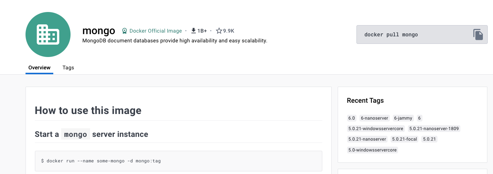
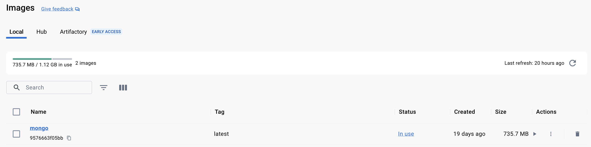
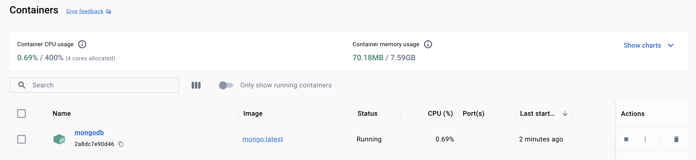
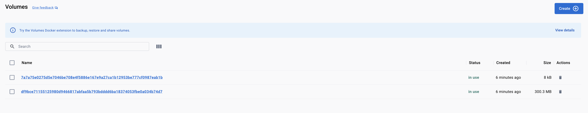
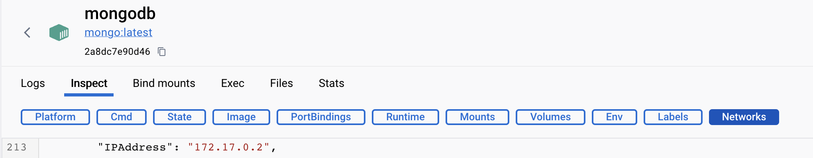
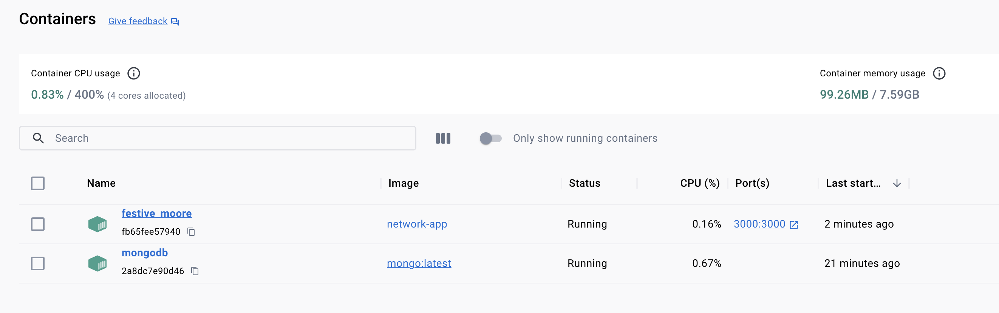
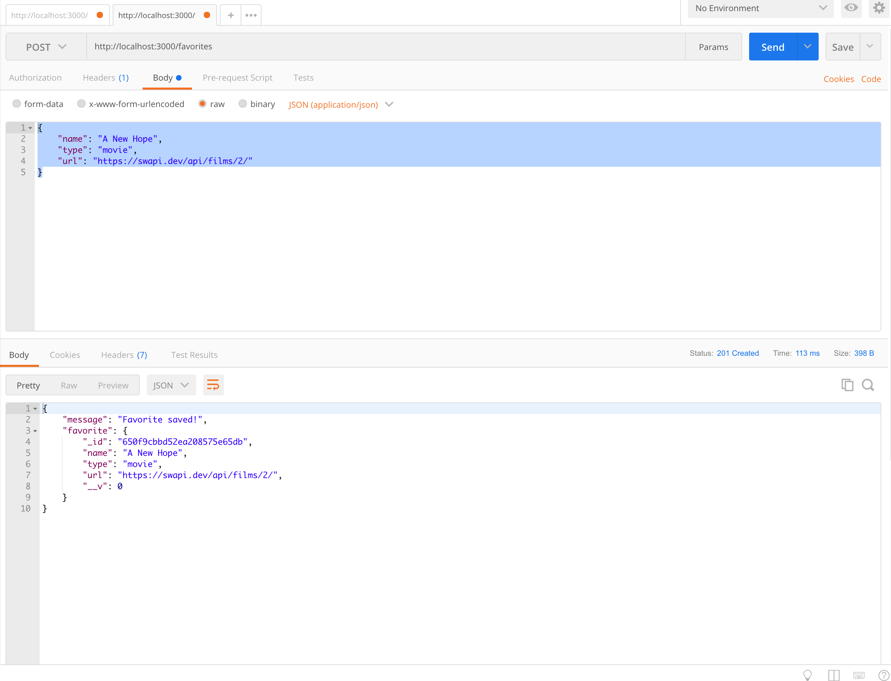
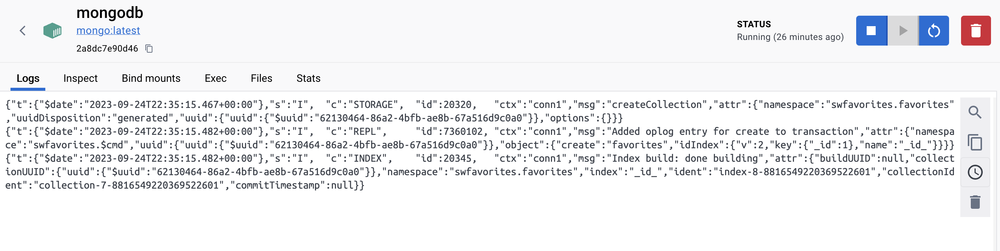
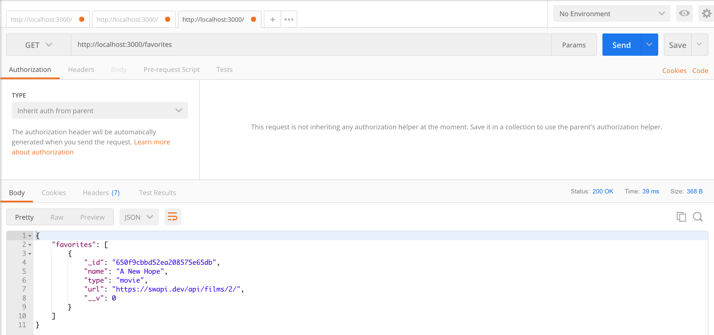

# `Container` to `Container` Basic Communication

## Running MongoDB from a Container
The official [Docker MongoDB Image](https://hub.docker.com/_/mongo) includes instructions on how
we can run the db engine from a container in "How to use this image" section.



```shell
docker run --name mongodb -d mongo:latest
```

```shell-output
Unable to find image 'mongo:latest' locally
latest: Pulling from library/mongo
44ba2882f8eb: Downloading [==============================================>    ]  28.37MB/30.44MB
ed0ba5360de5: Download complete 
4c432db3ad79: Download complete 
9afa5905ede6: Downloading [=========================>                         ]  111.8MB/217.4MB
8ca4cc7cbb16: Download complete 
```





## Inspecting the MongoDB to get the `ip`

```shell
docker ps
```

```shell-output
docker ps
CONTAINER ID   IMAGE          COMMAND                  CREATED         STATUS         PORTS       NAMES
2a8dc7e90d46   mongo:latest   "docker-entrypoint.s…"   3 minutes ago   Up 3 minutes   27017/tcp   mongodb
```

```shell
docker inspect mongodb
```

```json
[
    {
        "Id": "2a8dc7e90d463b092b31d3fafea8236b44bd5ba96c967cdbe75aa206b1d329eb",
        "Created": "2023-09-24T22:09:59.580866466Z",
        "Path": "docker-entrypoint.sh",
        "Args": [
            "mongod"
        ],
        "State": {
            "Status": "running",
            "Running": true,
            "Paused": false,
            "Restarting": false,
            "OOMKilled": false,
            "Dead": false,
            "Pid": 1574,
            "ExitCode": 0,
            "Error": "",
            "StartedAt": "2023-09-24T22:10:00.385739924Z",
            "FinishedAt": "0001-01-01T00:00:00Z"
        },
        ...
        "Name": "/mongodb",
        "HostConfig": {
          ...
        },
        "GraphDriver": {
          ...
        },
        "Mounts": [
            {
                "Type": "volume",
                "Name": "7a7a75e0275d5e7046be708e4f5886e167e9a27ca1b12953be777cf0987eab1b",
                "Source": "/var/lib/docker/volumes/7a7a75e0275d5e7046be708e4f5886e167e9a27ca1b12953be777cf0987eab1b/_data",
                "Destination": "/data/configdb",
                "Driver": "local",
                "Mode": "",
                "RW": true,
                "Propagation": ""
            },
            {
                "Type": "volume",
                "Name": "df9bce71155125980d9466817abfaa5b793bdddd6ba18374053fbe0a034b74d7",
                "Source": "/var/lib/docker/volumes/df9bce71155125980d9466817abfaa5b793bdddd6ba18374053fbe0a034b74d7/_data",
                "Destination": "/data/db",
                "Driver": "local",
                "Mode": "",
                "RW": true,
                "Propagation": ""
            }
        ],
        "Config": {
          ...
        },
        "NetworkSettings": {
             ...
            "Ports": {
                "27017/tcp": null
            },
            ...
            "Gateway": "172.17.0.1",
            "GlobalIPv6Address": "",
            "GlobalIPv6PrefixLen": 0,
            "IPAddress": "172.17.0.2",
            "IPPrefixLen": 16,
            "IPv6Gateway": "",
            "Networks": {
                "bridge": {
                    "Gateway": "172.17.0.1",
                    "IPAddress": "172.17.0.2",
                    "IPPrefixLen": 16,
                    "IPv6Gateway": "",
                    "GlobalIPv6Address": "",
                    "GlobalIPv6PrefixLen": 0,
                    "DriverOpts": null
                }
            }
        }
    }
]
```






## Updating the `host` in the Code

```js
mongoose.connect(
  'mongodb://172.17.0.2:27017/swfavorites',
  { useNewUrlParser: true },
  (err) => {
    if (err) {
      console.log(err);
    } else {
      app.listen(3000);
    }
  }
);
```

```shell
docker build -t network-app . 
```

````shell
 docker run -p 3000:3000 --rm -d network-app
````




### Writing to Container's **MongoDB** instance:

Payload:
```json
{
	"name": "A New Hope",
	"type": "movie",
	"url": "https://swapi.dev/api/films/2/"
}
```



```js
app.post('/favorites', async (req, res) => {
    const favName = req.body.name;
    const favType = req.body.type;
    const favUrl = req.body.url;

    try {
        const existingFav = await Favorite.findOne({ name: favName });
    } catch (error) {
        return res.status(500).json({ message: error.message });
    }

    const favorite = new Favorite({
        name: favName,
        type: favType,
        url: favUrl,
    });

    try {
        await favorite.save();
        res
            .status(201)
            .json({ message: 'Favorite saved!', favorite: favorite.toObject() });
    } catch (error) {
        res.status(500).json({ message: 'Something went wrong.' });
    }
});
```



### Reading from Container's **MongoDB** instance:

```shell
curl http://localhost:3000/favorites
```



```js
app.get('/favorites', async (req, res) => {
    const favorites = await Favorite.find();
    res.status(200).json({
        favorites: favorites,
    });
});
```