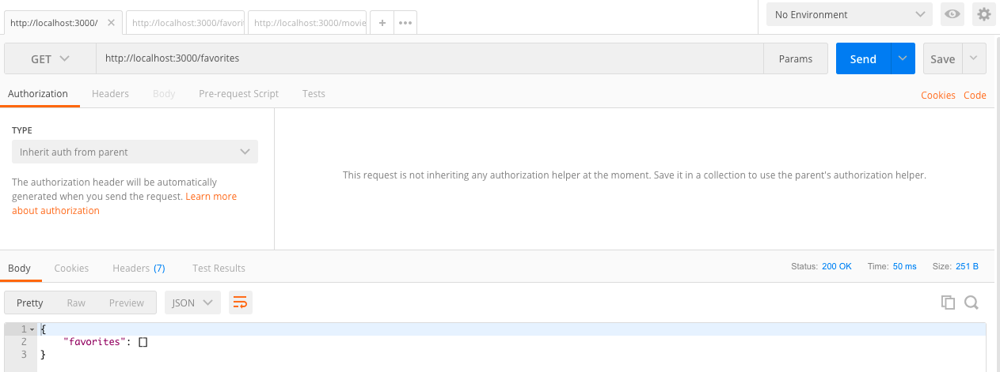

# Docker `Networks` for Cross `Container` Communication


## Creating a Network
Contrary to other Docker operations, networks will not be created 
automatically when using `--network` flag while running a `container`.

```shell-output
docker network --help

Usage:  docker network COMMAND

Manage networks

Commands:
  connect     Connect a container to a network
  create      Create a network
  disconnect  Disconnect a container from a network
  inspect     Display detailed information on one or more networks
  ls          List networks
  prune       Remove all unused networks
  rm          Remove one or more networks

```

```shell
docker network ls
```

```shell-output
docker network ls
NETWORK ID     NAME      DRIVER    SCOPE
ceebd7bc1d23   bridge    bridge    local
3ecb01aec358   host      host      local
9e4371adf77c   none      null      local
```

First, a Network needs to be created:

```shell
docker network create favorite-app-network
```

```shell-output
docker network ls                         
NETWORK ID     NAME                   DRIVER    SCOPE
ceebd7bc1d23   bridge                 bridge    local
f75336641b86   favorite-app-network   bridge    local
3ecb01aec358   host                   host      local
9e4371adf77c   none                   null      local
```

## Associating a `Network` to a `Container`

```shell
docker run --name mongodb-container --network favorite-app-network -d mongo:latest
```


## Updating the `host` in the Code

```js
mongoose.connect(
  'mongodb://mongodb-container:27017/swfavorites',
  { useNewUrlParser: true },
  (err) => {
    if (err) {
      console.log(err);
    } else {
      app.listen(3000);
    }
  }
);
```

```shell
docker build -t network-app .
```

````shell
docker run -p 3000:3000 --name network-app-container --network favorite-app-network --rm -d network-app
````


## Container Communication using `favorite-app-network` Network





