# Multi-Container Applications with Docker

## Manual Setup

**1. Creating a Network**

```shell
docker network create goals-net
```

```shell-output
docker network create goals-net
05f74a331ce8faee49b8a6857f2f8b959b452e89fbb5ed2b99798dcca71e72cc

docker network ls              
NETWORK ID     NAME        DRIVER    SCOPE
7e67fe583107   bridge      bridge    local
b828cedad932   goals-net   bridge    local
```

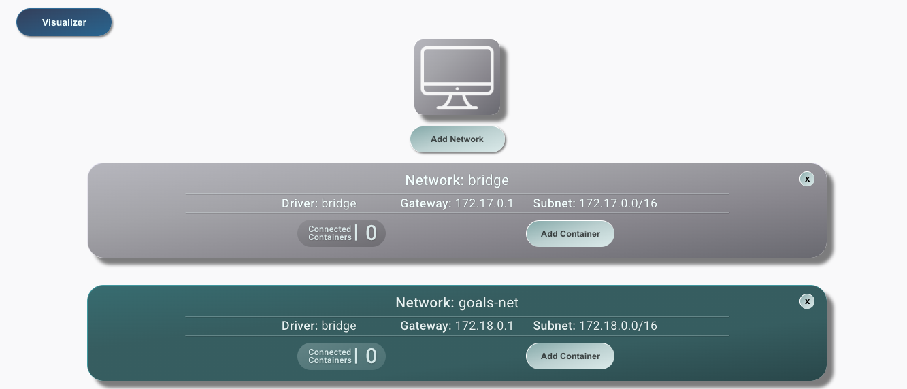

**2. Starting Mongo DB**

```shell
docker run --name mongodb \
  -e MONGO_INITDB_ROOT_USERNAME=max \
  -e MONGO_INITDB_ROOT_PASSWORD=secret \
  -v data:/data/db \
  --rm \
  -d \
  --network goals-net \
  mongo
```

```shell-output
docker ps
CONTAINER ID   IMAGE     COMMAND                  CREATED              STATUS              PORTS       NAMES
4b74628ed6c4   mongo     "docker-entrypoint.s…"   About a minute ago   Up About a minute   27017/tcp   mongodb
```

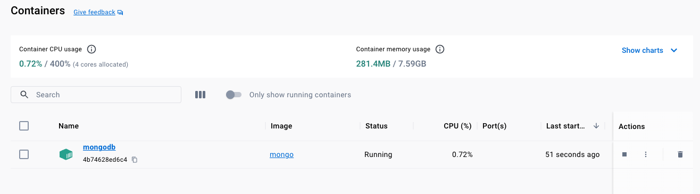

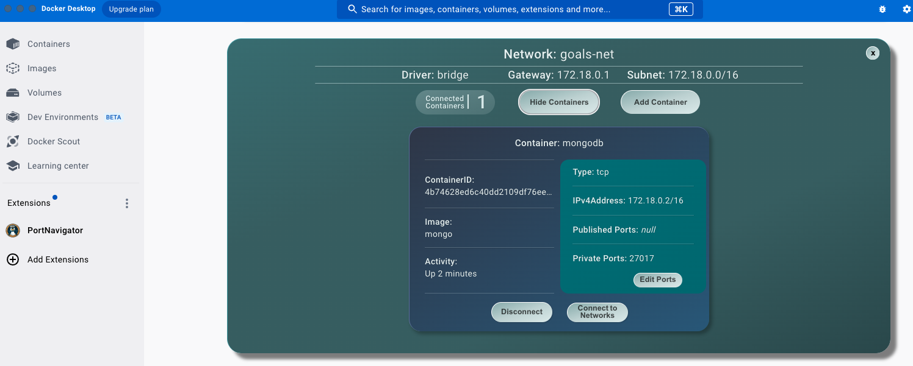

**3. Starting the Backend**

- **3.1 Building the `image`**
```shell
docker build -t goals-node ./apps/backend
```

```shell-output
docker build -t goals-node ./apps/backend
[+] Building 7.6s (10/10) FINISHED                                                                                                                                                         docker:desktop-linux
 => [internal] load build definition from Dockerfile                                                                                                                                                       0.0s
 => => transferring dockerfile: 245B                                                                                                                                                                       0.0s
 => [internal] load .dockerignore                                                                                                                                                                          0.0s
 => => transferring context: 115B                                                                                                                                                                          0.0s
 => [internal] load metadata for docker.io/library/node:latest                                                                                                                                             0.0s
 => [1/5] FROM docker.io/library/node                                                                                                                                                                      0.0s
 => [internal] load build context                                                                                                                                                                          0.0s
 => => transferring context: 10.16kB                                                                                                                                                                       0.0s
 => CACHED [2/5] WORKDIR /app                                                                                                                                                                              0.0s
 => [3/5] COPY package.json .                                                                                                                                                                              0.0s
 => [4/5] RUN npm install                                                                                                                                                                                  6.8s
 => [5/5] COPY . .                                                                                                                                                                                         0.0s
 => exporting to image                                                                                                                                                                                     0.6s
 => => exporting layers                                                                                                                                                                                    0.6s
 => => writing image sha256:a3b8be954bcbfceca2409861883570db0344eac49e088a0ba2858494ad636fb5                                                                                                               0.0s 
 => => naming to docker.io/library/goals-node                                
```

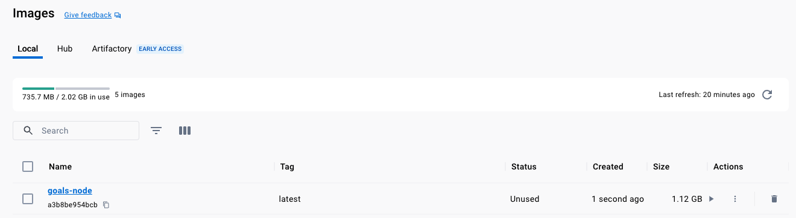

- **3.2 Running the `container`**

```shell
docker run --name goals-backend \
  -e MONGODB_USERNAME=max \
  -e MONGODB_PASSWORD=secret \
  -v logs:/app/logs \
  -v "$(pwd)/apps/backend:/app" \
  -v /app/node_modules \
  --rm \
  -d \
  --network goals-net \
  -p 80:80 \
  goals-node
```

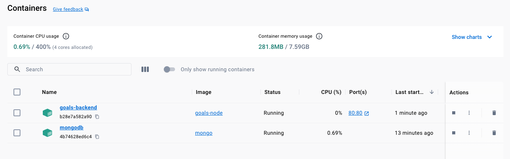

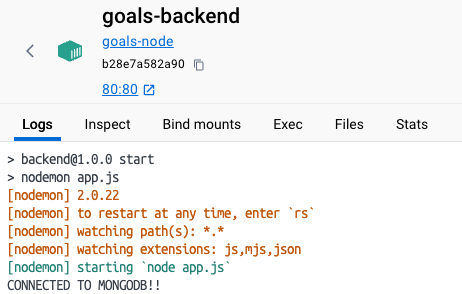

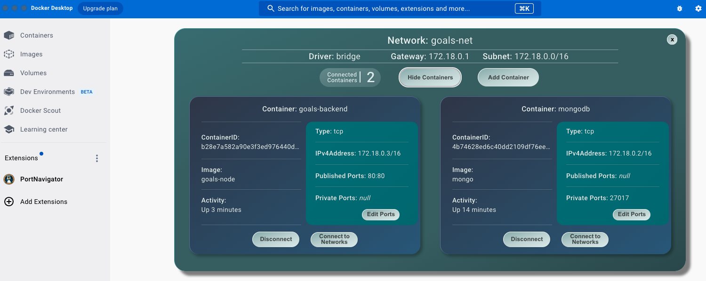

**4. Starting the frontend**

- **4.1 Building the `image`**

```shell
docker build -t goals-react ./apps/frontend
```

```shell-output
docker build -t goals-react ./apps/frontend
[+] Building 71.2s (10/10) FINISHED                                                                                                                                                        docker:desktop-linux
 => [internal] load .dockerignore                                                                                                                                                                          0.0s
 => => transferring context: 115B                                                                                                                                                                          0.0s
 => [internal] load build definition from Dockerfile                                                                                                                                                       0.0s
 => => transferring dockerfile: 239B                                                                                                                                                                       0.0s
 => [internal] load metadata for docker.io/library/node:latest                                                                                                                                             0.0s
 => [1/5] FROM docker.io/library/node                                                                                                                                                                      0.0s
 => [internal] load build context                                                                                                                                                                          0.0s
 => => transferring context: 1.18MB                                                                                                                                                                        0.0s
 => CACHED [2/5] WORKDIR /app                                                                                                                                                                              0.0s
 => [3/5] COPY package.json .                                                                                                                                                                              0.0s
 => [4/5] RUN npm install                                                                                                                                                                                 63.3s
 => [5/5] COPY . .                                                                                                                                                                                         0.0s
 => exporting to image                                                                                                                                                                                     7.8s
 => => exporting layers                                                                                                                                                                                    7.8s
 => => writing image sha256:d1d28d91c504b99821e1de942b55c20d80a1458795af67b0bc18729677e90e8c                                                                                                               0.0s 
 => => naming to docker.io/library/goals-react 
```

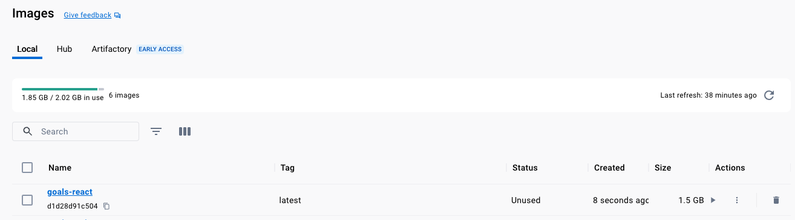

- **4.2 Running the `container`**

```shell
docker run --name goals-frontend \
  -v "$(pwd)/apps/frontend/src:/app/src" \
  --rm \
  -d \
  -p 3000:3000 \
  -it \
  goals-react
```

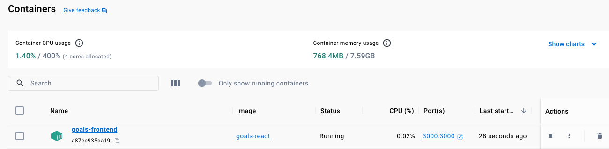

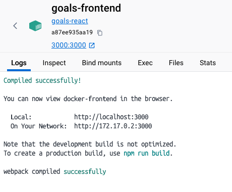

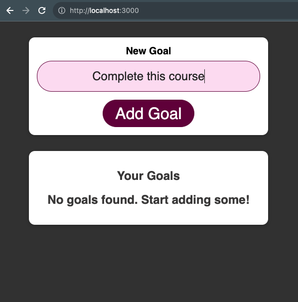

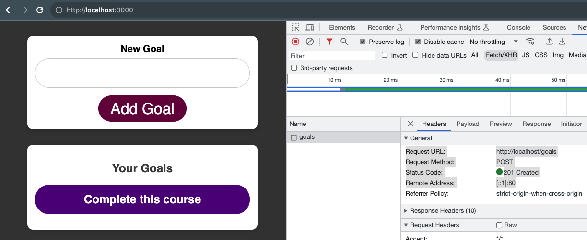


**4. Stop all Containers**

```shell
docker stop mongodb goals-backend goals-frontend
```

```shell-output
docker stop mongodb goals-backend goals-frontend
mongodb
goals-backend
goals-frontend
```


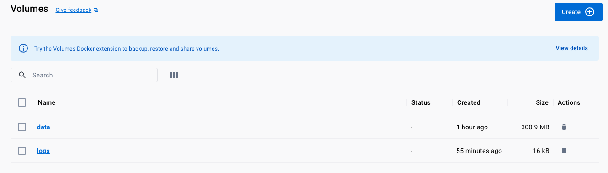

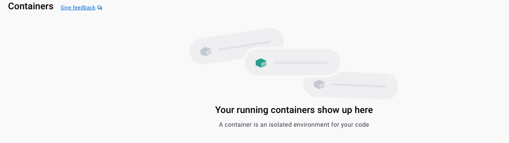