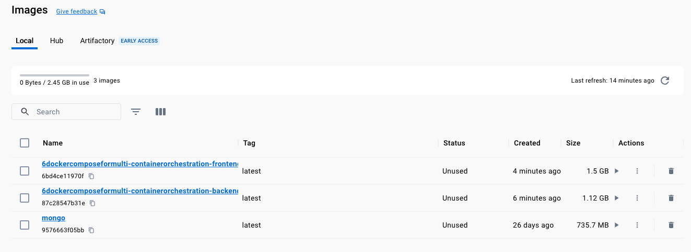
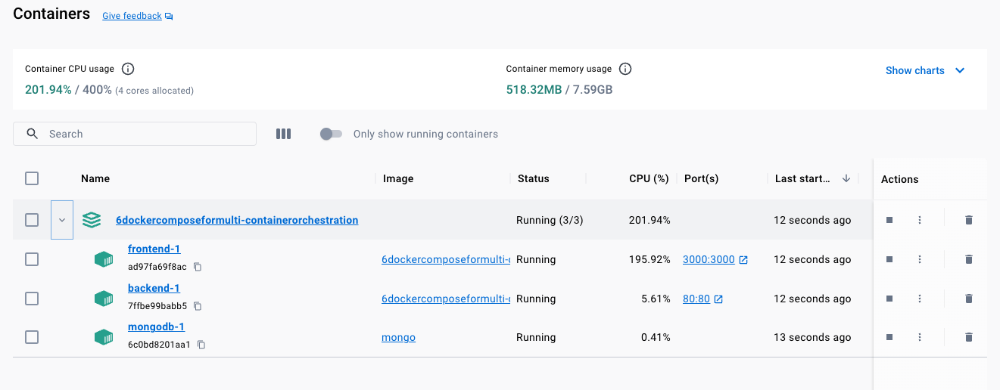
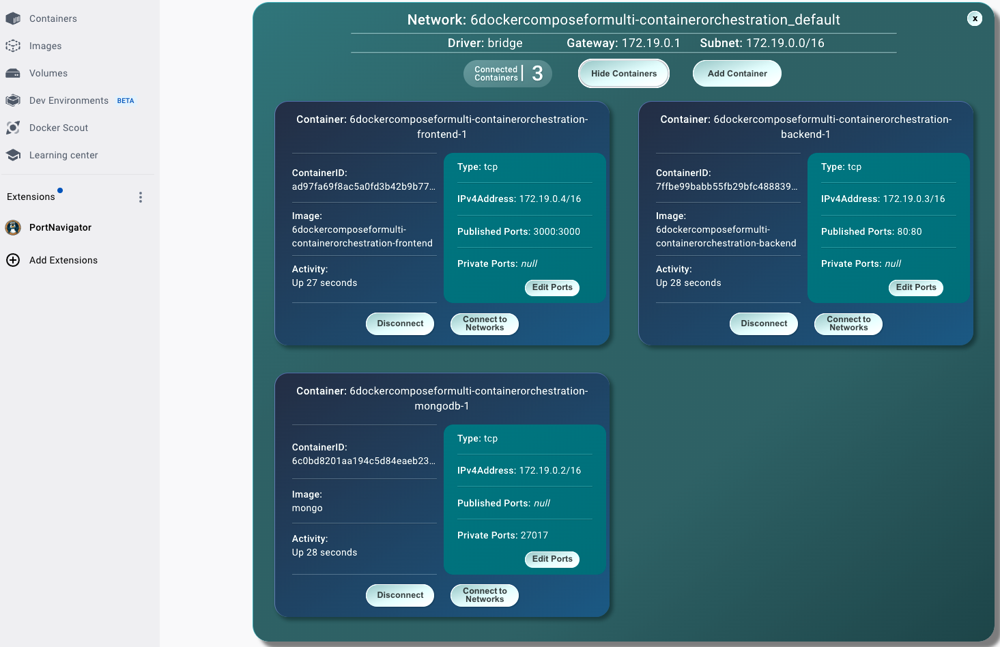
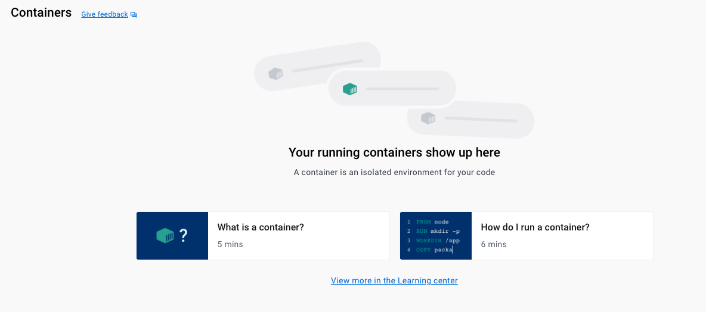
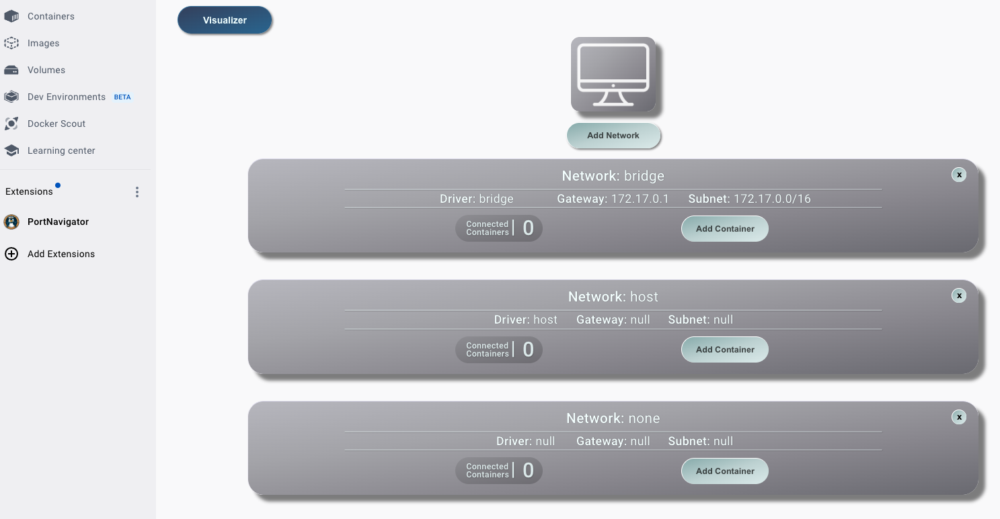

# Docker Compose: Multi-Container Orchestration

### **Clean Up**
```shell
docker image prune -a
docker container prune
```
>NOTE: this is only for clean up after Chapter 5.

## **1. Bringing Services Up**

```shell
docker compose up
```

For `detached` mode pass `-d`:
```shell
docker compose up -d
```

```shell-output
docker-compose up                                          
[+] Running 8/10
 ⠇ mongodb 9 layers [⣿⣿⣿⣿⣿⣿⣿⣦⣿] 158.2MB/217.4MB Pulling                                                                                                                                                   36.9s 
   ✔ 44ba2882f8eb Pull complete                                                                                                                                                                           22.0s 
   ✔ ed0ba5360de5 Pull complete                                                                                                                                                                            0.4s 
   ✔ a27add3570ee Pull complete                                                                                                                                                                            3.4s 
   ✔ fcfb29d27eb4 Pull complete                                                                                                                                                                            3.2s 
   ✔ ebd1e00f8db0 Pull complete                                                                                                                                                                            3.6s 
   ✔ 09a8f7a63d00 Pull complete                                                                                                                                                                            3.8s 
   ✔ 4c432db3ad79 Pull complete                                                                                                                                                                            4.1s 
   ⠏ 9afa5905ede6 Downloading     [====================================>              ]  158.2MB/217.4MB                                                                                                  34.9s 
   ✔ 8ca4cc7cbb16 Download complete                                                                                         
   ....
   Compiled successfully!
6dockercomposeformulti-containerorchestration-frontend-1  | 
6dockercomposeformulti-containerorchestration-frontend-1  | You can now view docker-frontend in the browser.
6dockercomposeformulti-containerorchestration-frontend-1  | 
6dockercomposeformulti-containerorchestration-frontend-1  |   Local:            http://localhost:3000
6dockercomposeformulti-containerorchestration-frontend-1  |   On Your Network:  http://172.19.0.4:3000
6dockercomposeformulti-containerorchestration-frontend-1  | 
6dockercomposeformulti-containerorchestration-frontend-1  | Note that the development build is not optimized.
6dockercomposeformulti-containerorchestration-frontend-1  | To create a production build, use npm run build.
6dockercomposeformulti-containerorchestration-frontend-1  | 
6dockercomposeformulti-containerorchestration-frontend-1  | webpack compiled successfully
6dockercomposeformulti-containerorchestration-mongodb-1   | {"t":{"$date":"2023-10-01T18:51:22.713+00:00"},"s":"I",  "c":"NETWORK",  "id":22...
6dockercomposeformulti-containerorchestration-mongodb-1   | {"t":{"$date":"2023-10-01T18:51:22.714+00:00"},"s":"I",  "c":"NETWORK",  "id":51800,...
```







```shell-output
docker ps
CONTAINER ID   IMAGE                                                    COMMAND                  CREATED          STATUS         PORTS                    NAMES
ac10b945cf09   6dockercomposeformulti-containerorchestration-frontend   "docker-entrypoint.s…"   9 seconds ago    Up 8 seconds   0.0.0.0:3000->3000/tcp   6dockercomposeformulti-containerorchestration-frontend-1
f4fbc8570725   6dockercomposeformulti-containerorchestration-backend    "docker-entrypoint.s…"   10 seconds ago   Up 8 seconds   0.0.0.0:80->80/tcp       6dockercomposeformulti-containerorchestration-backend-1
6b8bec9a2bdf   mongo                                                    "docker-entrypoint.s…"   10 seconds ago   Up 9 seconds   27017/tcp                6dockercomposeformulti-containerorchestration-mongodb-1
```

## **2. Bringing Services Down**

To bring services down and clean up `container`(s) and `network`(s):
```shell
docker-compose down
```

If you need to remove `volumes`:

```shell
docker-compose down -v
```





## **3. Customizing the Services Up/Down**

### 3.1 - Rebuilding `image`(s) while bringing services up

```shell
docker-compose up --build
```

```shell-output
 docker compose up --help

Usage:  docker compose up [OPTIONS] [SERVICE...]

Create and start containers

Options:
      --abort-on-container-exit   Stops all containers if any container was stopped. Incompatible with -d
      --always-recreate-deps      Recreate dependent containers. Incompatible with --no-recreate.
      --attach stringArray        Restrict attaching to the specified services. Incompatible with --attach-dependencies.
      --attach-dependencies       Automatically attach to log output of dependent services.
      --build                     Build images before starting containers.
  -d, --detach                    Detached mode: Run containers in the background
      --dry-run                   Execute command in dry run mode
      --exit-code-from string     Return the exit code of the selected service container. Implies --abort-on-container-exit
      --force-recreate            Recreate containers even if their configuration and image haven't changed.
      --no-attach stringArray     Do not attach (stream logs) to the specified services.
      --no-build                  Don't build an image, even if it's missing.
      --no-color                  Produce monochrome output.
      --no-deps                   Don't start linked services.
      --no-log-prefix             Don't print prefix in logs.
      --no-recreate               If containers already exist, don't recreate them. Incompatible with --force-recreate.
      --no-start                  Don't start the services after creating them.
      --pull string               Pull image before running ("always"|"missing"|"never") (default "missing")
      --quiet-pull                Pull without printing progress information.
      --remove-orphans            Remove containers for services not defined in the Compose file.
  -V, --renew-anon-volumes        Recreate anonymous volumes instead of retrieving data from the previous containers.
      --scale scale               Scale SERVICE to NUM instances. Overrides the scale setting in the Compose file if present.
  -t, --timeout int               Use this timeout in seconds for container shutdown when attached or when containers are already running.
      --timestamps                Show timestamps.
      --wait                      Wait for services to be running|healthy. Implies detached mode.
      --wait-timeout int          Maximum duration to wait for the project to be running|healthy.
```

### 3.2 - Rebuilding custom `image`(s)

```yaml
...
  backend:
    build: ./apps/backend
...
  frontend:
    build: ./apps/frontend
```

```shell
docker-compose build
```


### General Docker-Compose info

```shell-output
docker-compose --help

Usage:  docker compose [OPTIONS] COMMAND

Define and run multi-container applications with Docker.

Options:
      --ansi string                Control when to print ANSI control characters ("never"|"always"|"auto") (default "auto")
      --compatibility              Run compose in backward compatibility mode
      --dry-run                    Execute command in dry run mode
      --env-file stringArray       Specify an alternate environment file.
  -f, --file stringArray           Compose configuration files
      --parallel int               Control max parallelism, -1 for unlimited (default -1)
      --profile stringArray        Specify a profile to enable
      --progress string            Set type of progress output (auto, tty, plain, quiet) (default "auto")
      --project-directory string   Specify an alternate working directory
                                   (default: the path of the, first specified, Compose file)
  -p, --project-name string        Project name

Commands:
  build       Build or rebuild services
  config      Parse, resolve and render compose file in canonical format
  cp          Copy files/folders between a service container and the local filesystem
  create      Creates containers for a service.
  down        Stop and remove containers, networks
  events      Receive real time events from containers.
  exec        Execute a command in a running container.
  images      List images used by the created containers
  kill        Force stop service containers.
  logs        View output from containers
  ls          List running compose projects
  pause       Pause services
  port        Print the public port for a port binding.
  ps          List containers
  pull        Pull service images
  push        Push service images
  restart     Restart service containers
  rm          Removes stopped service containers
  run         Run a one-off command on a service.
  start       Start services
  stop        Stop services
  top         Display the running processes
  unpause     Unpause services
  up          Create and start containers
  version     Show the Docker Compose version information
  wait        Block until the first service container stops
```