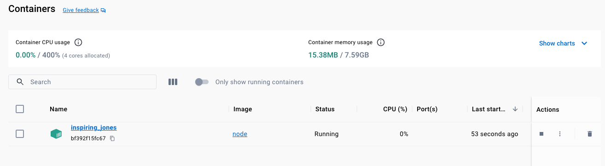
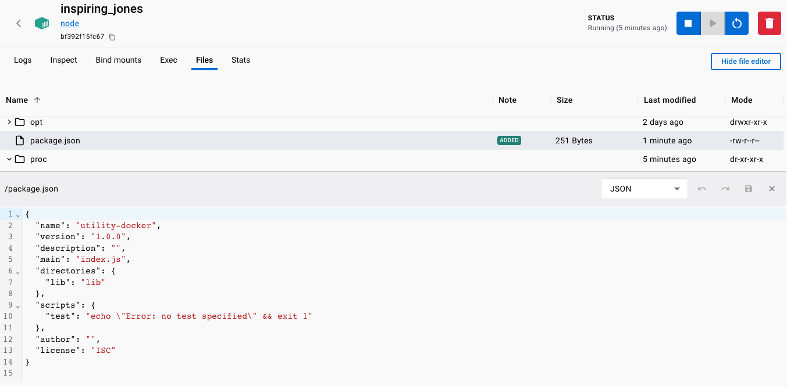
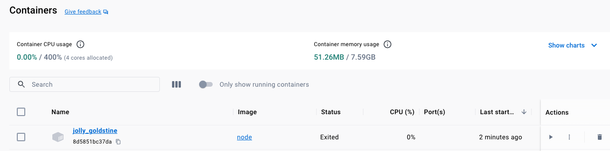
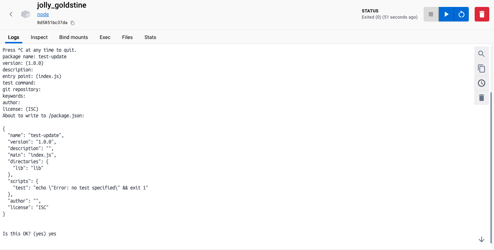
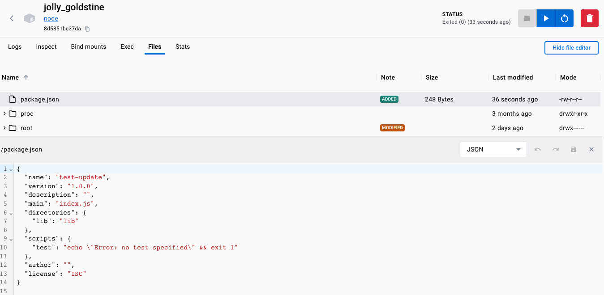

# Docker "Utility/Env" `Container`(s)
The idea is that these "type" of containers hold a certain type of environment 
to allow you to execute `commands` without installing in the host machine.

```shell-output
docker exec --help

Usage:  docker exec [OPTIONS] CONTAINER COMMAND [ARG...]

Execute a command in a running container

Aliases:
  docker container exec, docker exec

Options:
  -d, --detach               Detached mode: run command in the background
      --detach-keys string   Override the key sequence for detaching a container
  -e, --env list             Set environment variables
      --env-file list        Read in a file of environment variables
  -i, --interactive          Keep STDIN open even if not attached
      --privileged           Give extended privileges to the command
  -t, --tty                  Allocate a pseudo-TTY
  -u, --user string          Username or UID (format: "<name|uid>[:<group|gid>]")
  -w, --workdir string       Working directory inside the container
```

### 1. Running a `node` container
```shell
docker run -it -d node
```

```shell-output
 docker run -it -d node
Unable to find image 'node:latest' locally
latest: Pulling from library/node
167b8a53ca45: Already exists 
b47a222d28fa: Already exists 
debce5f9f3a9: Already exists 
1d7ca7cd2e06: Already exists 
94c7791033e8: Already exists 
c72c41e7648d: Already exists 
24b3fec6157f: Already exists 
ba7d01e69714: Already exists 
Digest: sha256:6b3f9aa7eefa8d4c93d43914e78aa2
Status: Downloaded newer image for node:latest
bf392f15fc672f957bd8bfe6698298f375c6978f1
```

```shell-output
docker ps
CONTAINER ID   IMAGE     COMMAND                  CREATED              STATUS              PORTS     NAMES
bf392f15fc67   node      "docker-entrypoint.s…"   About a minute ago   Up About a minute             inspiring_jones
```




### 2. Sending a command to the running `node` container

```shell
docker exec -it inspiring_jones npm init 
```

```shell-output
docker exec -it inspiring_jones npm init
This utility will walk you through creating a package.json file.
It only covers the most common items, and tries to guess sensible defaults.

See `npm help init` for definitive documentation on these fields
and exactly what they do.

Use `npm install <pkg>` afterwards to install a package and
save it as a dependency in the package.json file.

Press ^C at any time to quit.
package name: utility-docker
version: (1.0.0) 
description: 
entry point: (index.js) 
test command: 
git repository: 
keywords: 
author: 
license: (ISC) 
About to write to /package.json:

{
  "name": "utility-docker",
  "version": "1.0.0",
  "description": "",
  "main": "index.js",
  "directories": {
    "lib": "lib"
  },
  "scripts": {
    "test": "echo \"Error: no test specified\" && exit 1"
  },
  "author": "",
  "license": "ISC"
}
```



> NOTE: Could be useful when interacting with running containers.

```shell-output
docker exec -it inspiring_jones node -v
v20.8.0
```

### 3. Overriding the `default` container's `node` command (REPL)

```shell
docker image inspect node
```

```shell-output
...
"Cmd": [
                "/bin/sh",
                "-c",
                "#(nop) ",
                "CMD [\"node\"]"
            ],
```

We will send the override as `npm init`:

```shell
docker run -it node npm init
```

```shell-output
docker run -it node npm init
This utility will walk you through creating a package.json file.
It only covers the most common items, and tries to guess sensible defaults.

See `npm help init` for definitive documentation on these fields
and exactly what they do.

Use `npm install <pkg>` afterwards to install a package and
save it as a dependency in the package.json file.

Press ^C at any time to quit.
package name: test-update
version: (1.0.0) 
description: 
entry point: (index.js) 
test command: 
git repository: 
keywords: 
author: 
license: (ISC) 
About to write to /package.json:

{
  "name": "test-update",
  "version": "1.0.0",
  "description": "",
  "main": "index.js",
  "directories": {
    "lib": "lib"
  },
  "scripts": {
    "test": "echo \"Error: no test specified\" && exit 1"
  },
  "author": "",
  "license": "ISC"
}


Is this OK? (yes) yes
```








