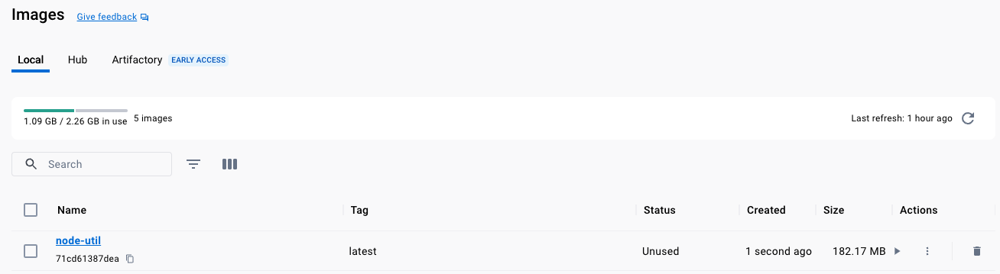
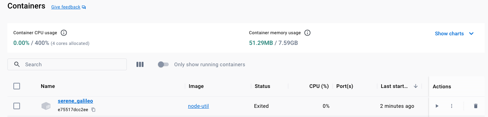
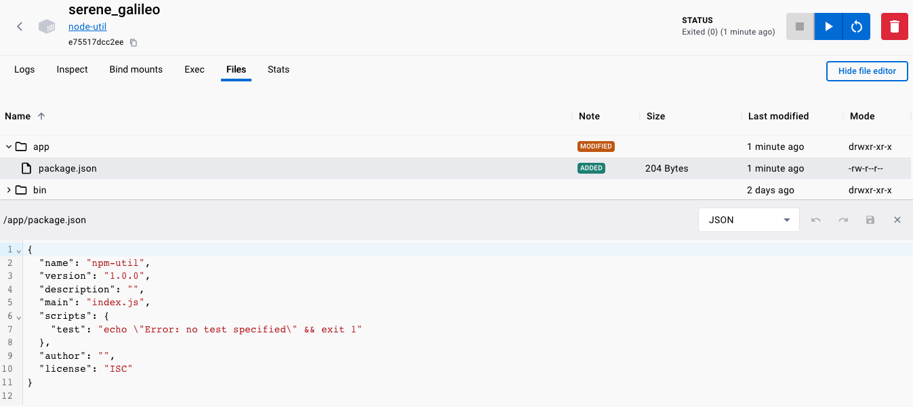
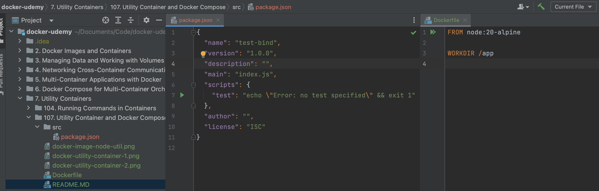
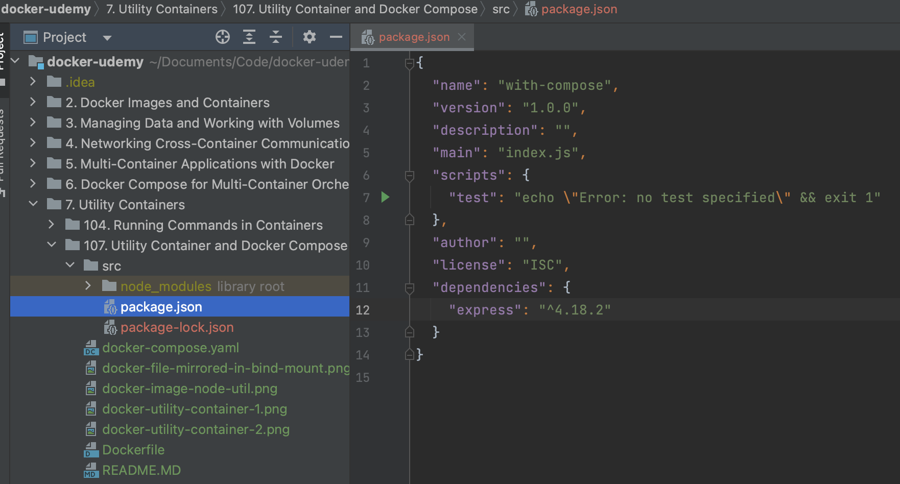

# Docker "Utility/Env" `Container`(s)
The idea is that these "type" of containers hold a certain type of environment 
to allow you to execute `commands` without installing in the host machine.

In this example we will leverage `npm` included in `node` by forwarding our commands
to the node `container` and mirroring the output to the host machine using a `bind mount`.

## 1. Building the utility `node` `image`

```shell
docker build -t node-util .
```



## 2. Running the utility `node-util` `image`

```shell
docker run -it node-util npm init
```

```shell-output
docker run -it node-util npm init
This utility will walk you through creating a package.json file.
It only covers the most common items, and tries to guess sensible defaults.

See `npm help init` for definitive documentation on these fields
and exactly what they do.

Use `npm install <pkg>` afterwards to install a package and
save it as a dependency in the package.json file.

Press ^C at any time to quit.
package name: (app) npm-util
version: (1.0.0) 
description: 
entry point: (index.js) 
test command: 
git repository: 
keywords: 
author: 
license: (ISC) 
About to write to /app/package.json:

{
  "name": "npm-util",
  "version": "1.0.0",
  "description": "",
  "main": "index.js",
  "scripts": {
    "test": "echo \"Error: no test specified\" && exit 1"
  },
  "author": "",
  "license": "ISC"
}


Is this OK? (yes) 
```






## 3. Using a `bind mount` for `node-util` `container`

```shell
docker run -it -v "$(pwd)/src:/app" node-util npm init
```



```shell-output
docker run -it -v "$(pwd)/src:/app" node-util npm init
This utility will walk you through creating a package.json file.
It only covers the most common items, and tries to guess sensible defaults.

See `npm help init` for definitive documentation on these fields
and exactly what they do.

Use `npm install <pkg>` afterwards to install a package and
save it as a dependency in the package.json file.

Press ^C at any time to quit.
package name: (app) test-bind
version: (1.0.0) 
description: 
entry point: (index.js) 
test command: 
git repository: 
keywords: 
author: 
license: (ISC) 
About to write to /app/package.json:

{
  "name": "test-bind",
  "version": "1.0.0",
  "description": "",
  "main": "index.js",
  "scripts": {
    "test": "echo \"Error: no test specified\" && exit 1"
  },
  "author": "",
  "license": "ISC"
}
```

## 3. `ENTRYPOINT` to prepend `npm` for `node-util` commands
This is useful to **"limit"** or **"namespace"** the commands that can be executed in the utility container.

```dockerfile
...
ENTRYPOINT ["npm"]
```

All the commands will be prefixed with `npm`, in this case `node-util init` will become `node-util npm init`

```shell
docker build -t node-util .
```

Creating the `package.json`:
```shell
docker run -it -v "$(pwd)/src:/app" node-util init
```

Installing dependencies:
```shell
docker run -it -v "$(pwd)/src:/app" node-util install express
```

```json
{
  "name": "test",
  "version": "1.0.0",
  "description": "",
  "main": "index.js",
  "scripts": {
    "test": "echo \"Error: no test specified\" && exit 1"
  },
  "author": "",
  "license": "ISC",
  "dependencies": {
    "express": "^4.18.2"
  }
}
```


## 4. Docker Compose to simplify `container` command execution

```dockerfile
FROM node:20-alpine
WORKDIR /app
ENTRYPOINT ["npm"]
```

```yaml
services:
  npm:
    build: ./
    stdin_open: true
    tty: true
    volumes:
      - ./src:/app
```

`docker-compose run --rm [service:name:in:yaml] [command:to:execute]`

```shell
docker-compose run --rm npm init
```

```shell
docker-compose run --rm npm install express
```


