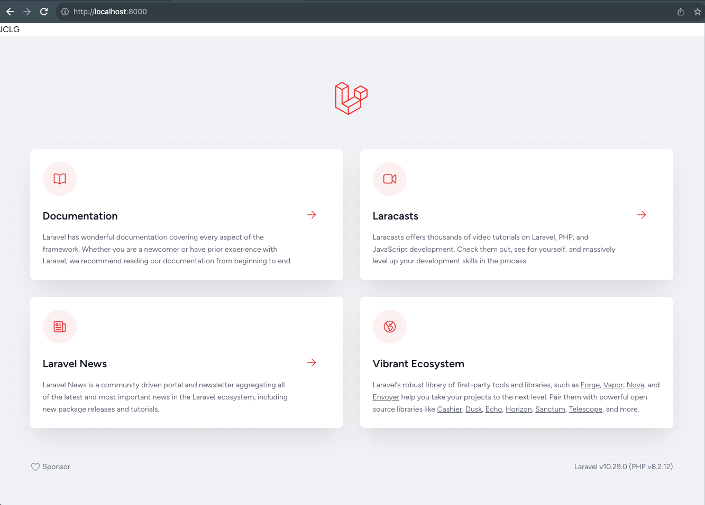

# Docker Compose: Complex Setup Nginx, Laravel and MySQL

## Laravel - Create an app

[Create Project Docs](https://laravel.com/docs/10.x/installation#your-first-laravel-project)

```bash-example
composer create-project laravel/laravel example-app
```

```bash
docker-compose run --rm composer create-project --prefer-dist laravel/laravel .
```

In the command above `.` refers to

```dockerfile
WORKDIR /var/www/html
```

which is mapped to `src` in the bind mount `./src:/var/www/html`

```yaml
  composer:
    build:
      context: ./dockerfiles
      dockerfile: composer.dockerfile
    volumes:
      - ./src:/var/www/html
```

And then updated the Laravel `env` file:

```env
DB_CONNECTION=mysql
DB_HOST=127.0.0.1
DB_PORT=3306
DB_DATABASE=laravel
DB_USERNAME=root
DB_PASSWORD=
```

to match the other services in Docker:

```
DB_CONNECTION=mysql
DB_HOST=mysql
DB_PORT=3306
DB_DATABASE=homestead
DB_USERNAME=homestead
DB_PASSWORD=secret
```

from `mysql.env`


## Running the app

```bash
docker-compose up --build
```

